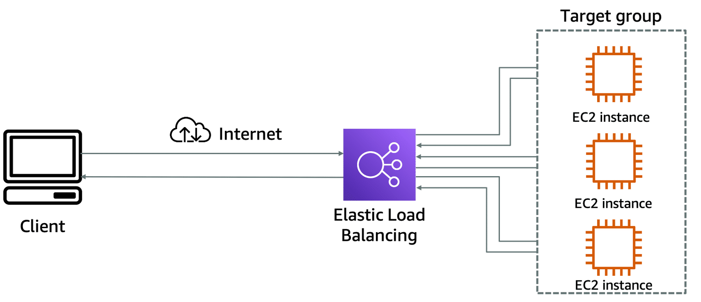
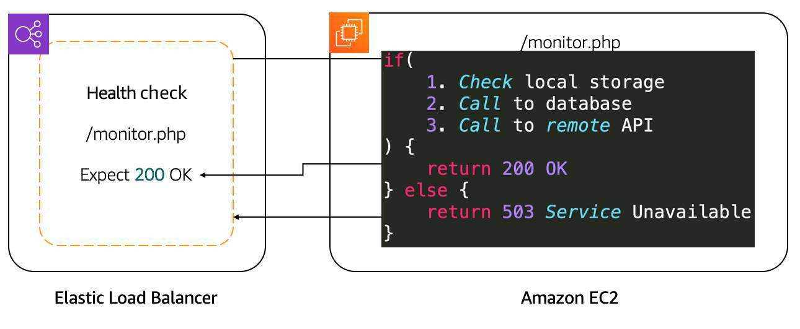
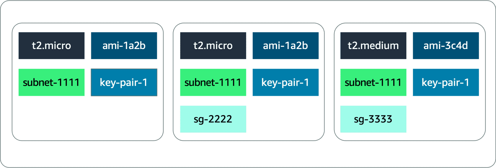
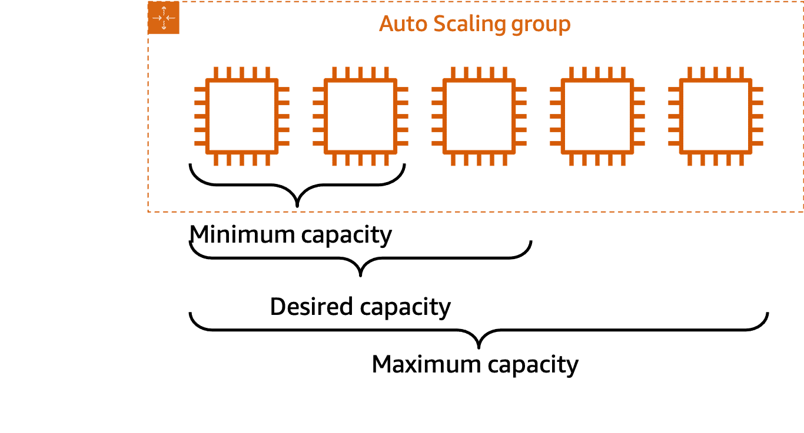
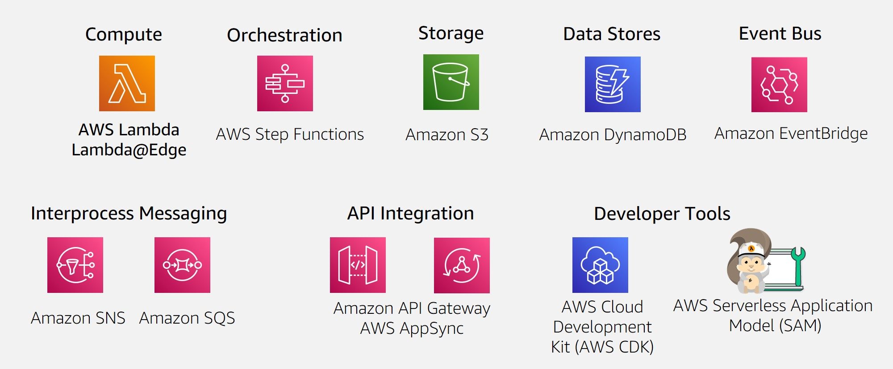
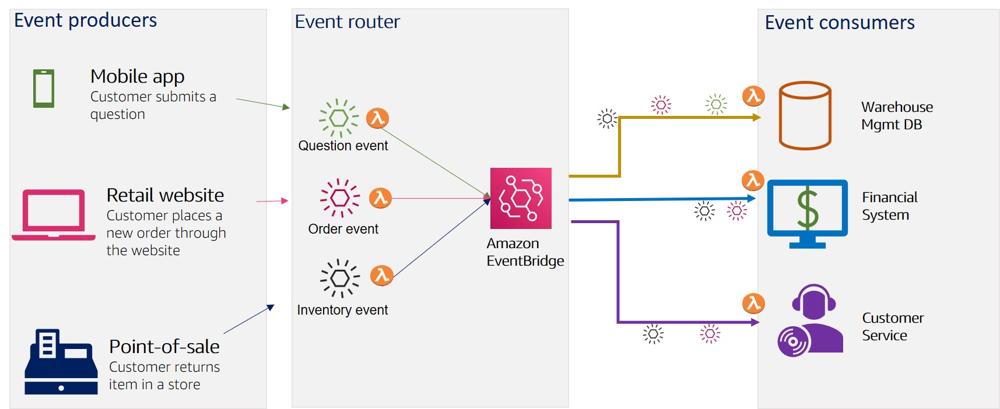
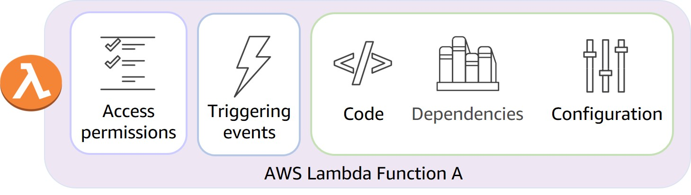
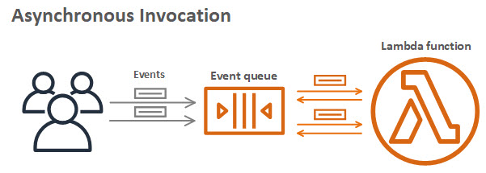
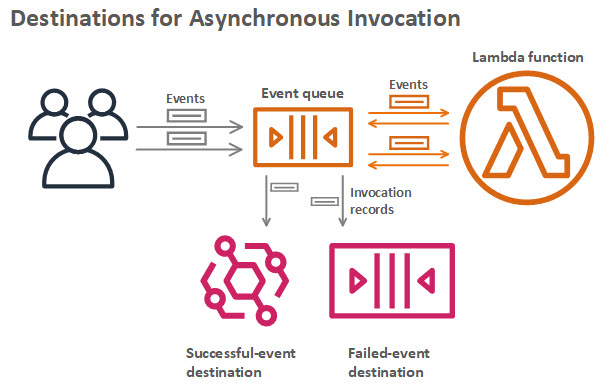
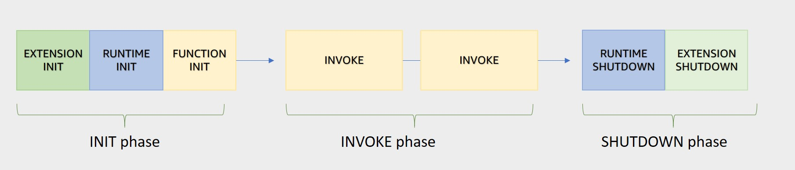

## EC2 instance families

| Instance family       |                                                                                                                                                        Description                                                                                                                                                         |                                                                                                                                                                                                                                                                Use Cases |
|-----------------------|:--------------------------------------------------------------------------------------------------------------------------------------------------------------------------------------------------------------------------------------------------------------------------------------------------------------------------:|-------------------------------------------------------------------------------------------------------------------------------------------------------------------------------------------------------------------------------------------------------------------------:|
| General purpose       |                                                                                           General purpose instances provide a balance of compute, memory, and networking resources, and can be used for a variety of workloads.                                                                                            |                                                                                                                                                          Ideal for applications that use these resources in equal proportions, such as web servers and code repositories |
| Compute optimized     |                                                                                                    Compute optimized instances are ideal for compute-bound applications that benefit from high-performance processors.                                                                                                     | Well-suited for batch processing workloads, media transcoding, high performance web servers, high performance computing (HPC), scientific modeling, dedicated gaming servers and ad server engines, machine learning inference, and other compute intensive applications |
| Memory optimized      |                                                                                                  Memory optimized instances are designed to deliver fast performance for workloads that process large datasets in memory.                                                                                                  |                                                                 Memory-intensive applications, such as high-performance databases, distributed web-scale in-memory caches, mid-size in-memory databases, real-time big-data analytics, and other enterprise applications |
| Accelerated computing |                                  Accelerated computing instances use hardware accelerators or co-processors to perform functions such as floating-point number calculations, graphics processing, or data pattern matching more efficiently than is possible in software running on CPUs.                                  |                                                                                                                Machine learning, HPC, computational fluid dynamics, computational finance, seismic analysis, speech recognition, autonomous vehicles, and drug discovery |
| Storage optimized     | Storage optimized instances are designed for workloads that require high sequential read and write access to large datasets on local storage. They are optimized to deliver tens of thousands of low-latency random I/O operations per second (IOPS) to applications that replicate their data across different instances. |                                                                                                                   NoSQL databases (Cassandra, MongoDB and Redis), in-memory databases, scale-out transactional databases, data warehousing, Elasticsearch, and analytics |
| HPC optimized         |                                                                                        High performance computing (HPC) instances are purpose built to offer the best price performance for running HPC workloads at scale on AWS.                                                                                         |                                                                                                                                     Ideal for applications that benefit from high-performance processors, such as large, complex simulations and deep learning workloads |

## Serverless

With serverless compute, you can spend time on the things that differentiate your application,
rather than spending time on ensuring `availability`, `scaling`, and `managing servers`. Every
definition
of serverless mentions the following four aspects:

- no servers to provision or manage.
- scales with usage.
- You never pay for idle resources.
- Availability and fault tolerance are built in.

## Fargate

AWS Fargate is a purpose-built **serverless compute engine for containers**. AWS Fargate scales and
manages the infrastructure by allocating the right amount of compute. This eliminates the need to
choose and
manage EC2 instances, cluster capacity, and scaling. Fargate supports both Amazon ECS and Amazon EKS
architecture and provides workload isolation and improved security by design.


## AWS Lambda

A **function** is a resource that is invoked to run the code in Lambda. Lambda runs instances of a
function to process events.

**Triggers** describe when a Lambda function should run. A trigger integrates a Lambda function with
other AWS services and event source mappings.

An **event** is a JSON-formatted document that contains data for a Lambda function to process. The
runtime converts the event to an object and passes it to the function code. When you invoke a
function, you determine the structure and contents of the event.

An **application environment** provides a **secure** and **isolated** runtime environment for a
Lambda function. An application environment manages the processes and resources that are required to
run the function.

Lambda supports two types of **deployment packages**:

- A .zip file archive – containing the function code and its dependencies

- A container image – compatible with the Open Container Initiative (OCI) specification. You
  add your function code and dependencies to the image. You must also include the operating system
  and a Lambda runtime.

The **runtime** provides a language-specific environment that runs in an application environment.

The AWS **Lambda function handler** is the method in the function code that processes events. When
the function is invoked, Lambda runs the handler method. When the handler exits or returns a
response, it becomes available to handle another event.

Python example:

```
def handler_name (event, context):

...

return some_value
```

## Pricing

With **On-Demand** Instances, you pay for compute capacity per hour or per second, depending on
which instances that you run. Billing begins whenever the instance is running, and billing stops
when the instance is in a stopped or terminated state.

Use cases:

- low cost and flexibility of Amazon EC2 without upfront payment or long-term
  commitments
- Applications with short-term, spiky, or unpredictable workloads that cannot be interrupted
- Applications being developed or tested on Amazon EC2 for the first time

With Amazon EC2 **Spot Instances**, you can request spare Amazon EC2 computing capacity for up to 90
percent off the On-Demand price.

Use cases:

- Applications that have flexible start and end times
- Applications that are only feasible at very low compute prices
- Users with fault-tolerant or stateless workloads

With Spot Instances, you set a limit on how much you want to pay for the instance hour. This is
compared against the current Spot price that AWS determines. If the amount that you pay is more than
the current Spot price and there is capacity, you will receive an instance.

**Savings Plans** are a flexible pricing model that offers low usage prices for a 1-year or 3-year
term commitment to a consistent amount of usage. Savings Plans apply to Amazon EC2, AWS Lambda, and
AWS Fargate usage and provide up to 72 percent savings on AWS compute usage.

For workloads that have predictable and consistent usage, Savings Plans can provide significant
savings compared to On-Demand Instances.

Use cases:

- Workloads with a consistent and steady-state usage
- Customers who want to use different instance types and compute solutions across different
  locations
- Customers who can make monetary commitment to use Amazon EC2 over a 1-year or 3-year term

For applications with steady state usage that might require reserved capacity, Amazon EC2 offers the
**Reserved Instances** option. With this option, you save up to 75 percent compared to On-Demand
Instance pricing. You can choose between three payment options: All Upfront, Partial Upfront, or No
Upfront. You can select either a 1-year or 3-year term for each of these options.

With **Reserved Instances**, you can choose the type that best fits your applications needs.

- Standard Reserved Instances: These provide the most significant discount (up to 72 percent off
  On-Demand pricing) and are best suited for steady-state usage.
- Convertible Reserved Instances: These provide a discount (up to 54 percent off On-Demand pricing)
  and the capability to change the attributes of the Reserved Instance if the exchange results in
  the creation of Reserved Instances of equal or greater value. Like Standard Reserved Instances,
  Convertible Reserved Instances are best suited for steady-state usage.
- Scheduled Reserved Instances: These are available to launch within the time windows that you
  reserve. With this option, you can match your capacity reservation to a predictable recurring
  schedule that only requires a fraction of a day, a week, or a month.

A **Dedicated Host** is a physical Amazon EC2 server that is dedicated for your use. Dedicated Hosts
can help you reduce costs because you can use your existing server-bound software licenses, such as
Windows Server, SQL Server, and Oracle licenses. And they can also help you meet compliance
requirements. Amazon EC2 Dedicated Host is also integrated with AWS License Manager, a service that
helps you manage your software licenses, including Microsoft Windows Server and Microsoft SQL Server
licenses.

- Dedicated Hosts can be purchased on demand (hourly).
- Dedicated Hosts can be purchased as a Reservation for up to 70 percent off the On-Demand price.

## Amazon VPC

A virtual private cloud (VPC) is an isolated network.
After you create your VPC, you must create **subnets** inside the network. The typical use case for
subnets is to isolate or optimize network traffic. In AWS, subnets are used to provide high
availability and connectivity options for your resources.

**Reserved IPs**

For AWS to configure your VPC appropriately, AWS reserves five IP addresses in each subnet. These IP
addresses are used for routing, Domain Name System (DNS), and network management.

For example, consider a VPC with the IP range 10.0.0.0/22. The VPC includes 1,024 total IP
addresses. This is then divided into four equal-sized subnets, each with a /24 IP range with 256 IP
addresses. Out of each of those IP ranges, there are only 251 IP addresses that can be used because
AWS reserves five.


AWS reserves five IP addresses in each subnet that cannot be assigned to a resource.

The five reserved IP addresses can impact how you design your network. A common starting place for
those who are new to the cloud is to create a VPC with an IP range of /16 and create subnets with an
IP range of /24. This provides a large amount of IP addresses to work with at both the VPC and
subnet levels.

### Gateways

**Internet gateway**

To activate internet connectivity for your VPC, you must create an internet gateway. Think of the
gateway as similar to a modem. Just as a modem connects your computer to the internet, the internet
gateway connects your VPC to the internet. Unlike your modem at home, which sometimes goes down or
offline, an internet gateway is highly available and scalable. After you create an internet gateway,
you attach it to your VPC.
An internet gateway is a VPC component that permits communication between your VPC and the internet.
A virtual private gateway is the VPN endpoint on the Amazon side of your VPN connection that can be
attached to a single VPC.


**Virtual private gateway**

A virtual private gateway connects your VPC to another private network. When you create and attach a
virtual private gateway to a VPC, the gateway acts as anchor on the AWS side of the connection. On
the other side of the connection, you will need to connect a customer gateway to the other private
network. A customer gateway device is a physical device or software application on your side of the
connection. When you have both gateways, you can then establish an encrypted virtual private
network (VPN) connection between the two sides.


**AWS Direct Connect**

To establish a secure physical connection between your on-premises data center and your Amazon VPC,
you can use AWS Direct Connect. With AWS Direct Connect, your internal network is linked to an AWS
Direct Connect location over a standard Ethernet fiber-optic cable. This connection allows you to
create virtual interfaces directly to public AWS services or to your VPC.


### Main route table

When you create a VPC, AWS creates a route table called the **main route table**. A route table
contains a set of rules, called **routes**, that are used to determine where network traffic is
directed. AWS assumes that when you create a new VPC with subnets, you want traffic to flow between
them. Therefore, the default configuration of the main route table is to allow traffic between all
subnets in the local network.

The following **rules** apply to the main route table:

- You cannot delete the main route table.
- You cannot set a gateway route table as the main route table.
- You can replace the main route table with a custom subnet route table.
- You can add, remove, and modify routes in the main route table.
- You can explicitly associate a subnet with the main route table, even if it's already
  implicitly associated.

### Custom route tables

The main route table is used implicitly by subnets that do not have an explicit route table
association. However, you might want to provide different routes on a per-subnet basis for traffic
to access resources outside of the VPC. For example, your application might consist of a frontend
and a database. You can create separate subnets for the resources and provide different routes for
each of them.

If you associate a subnet with a custom route table, the subnet will use it instead of the main
route table. Each custom route table that you create will have the local route already inside it,
allowing communication to flow between all resources and subnets inside the VPC. You can protect
your VPC by explicitly associating each new subnet with a custom route table and leaving the main
route table in its original default state.


### Secure subnets with network access control lists

Think of a network access control list (network **ACL**) as a virtual firewall at the subnet level.
A network ACL lets you control what kind of traffic is allowed to enter or leave your subnet. You
can configure this by setting up rules that define what you want to filter.

Network ACLs are considered **stateless**, so you need to include **both** the **inbound and
outbound** ports used for the protocol. If you don’t include the outbound range, your server would
respond but the traffic would never leave the subnet.

Because network ACLs are configured by **default** to **allow incoming and outgoing traffic**, you
don’t need to change their initial settings unless you need additional security layers.

### Secure EC2 instances with security groups

The default configuration of a **security group** blocks all inbound traffic and allows all outbound
traffic.

Security groups are **stateful**. That means that they will remember if a connection is originally
initiated by the EC2 instance or from the outside, and temporarily allow traffic to respond without
modifying the inbound rules.

_**Example**_

**Subnets** can be used to segregate traffic between computers in your network. **Security groups**
can be used in the same way. A **common design pattern** is to organize resources into different
groups and create security groups for each to control network communication between them.
Network traffic between different resource groups can be controlled using security groups.


This example defines three tiers and isolates each tier with defined security group rules. In this
case, internet traffic to the web tier is allowed over HTTPS. Web tier to application tier traffic
is allowed over HTTP, and application tier to database tier traffic is allowed over MySQL. This is
different from traditional on-premises environments, in which you isolate groups of resources with a
VLAN configuration. In AWS, security groups allow you to achieve the same isolation without tying
the security groups to your network.

## Storage Types


### File storage

Ideal when you require **centralized access** to files that must be **easily shared and managed** by
multiple host computers. Typically, this storage is mounted onto multiple hosts, and requires file
locking and integration with existing file system communication protocols.

#### Use cases for file storage

- **Web serving**: Cloud file storage solutions follow common file-level protocols, file naming
  conventions, and permissions that developers are familiar with. Therefore, file storage can be
  integrated into web applications.


- **Analytics**: Many analytics workloads interact with data through a file interface and rely on
  features such as file lock or writing to portions of a file. Cloud-based file storage supports
  common file-level protocols and has the ability to scale capacity and performance. Therefore, file
  storage can be conveniently integrated into analytics workflows.


- **Media & entertainment**: Many businesses use a hybrid cloud deployment and need standardized
  access using file system protocols (NFS or SMB) or concurrent protocol access. Cloud file storage
  follows existing file system semantics. Therefore, storage of rich media content for processing
  and collaboration can be integrated for content production, digital supply chains, media
  streaming, broadcast playout, analytics, and archive.


- **Home directories**: Businesses wanting to take advantage of the scalability and cost benefits of
  the cloud are extending access to home directories for many of their users. Cloud file storage
  systems adhere to common file-level protocols and standard permissions models. Therefore,
  customers can lift and shift applications that need this capability to the cloud.

### Block storage

File storage treats files as a singular unit, but block storage splits files into fixed-size chunks
of data called blocks that have their own addresses. Each block is an individual piece of data
storage. Because each block is addressable, blocks can be retrieved efficiently. Think of block
storage as a more direct route to access the data.

When data is requested, the addresses are used by the storage system to organize the blocks in the
correct order to form a complete file to present back to the requester. Besides the address, no
additional metadata is associated with each block.

If you want to change one character in a file, you just change the block, or the piece of the file,
that contains the character. This ease of access is why block storage solutions are fast and use
less bandwidth.

#### Use cases for block storage

Because block storage is optimized for **low-latency operations**, it is a preferred storage choice
for **high-performance** enterprise workloads and **transactional**, **mission-critical**, and
**I/O-intensive** applications.

### Object storage

In object storage, files are stored as objects. Objects, much like files, are treated as a single,
distinct unit of data when stored. However, unlike file storage, these objects are stored in a
bucket using a **flat structure**, meaning there are no folders, directories, or complex
hierarchies. Each object contains a unique identifier. This identifier, along with any additional
metadata, is bundled with the data and stored.

#### Use cases for object storage

With object storage, you can store almost any type of data, and there is **no limit** to the number
of objects stored, which makes it readily scalable. Object storage is generally useful when storing
**large or unstructured data sets**.

**Data archiving**

Cloud object storage is excellent for long-term data retention. You can cost-effectively archive
large amounts of rich media content and retain mandated regulatory data for extended periods of
time. You can also use cloud object storage to replace on-premises tape and disk archive
infrastructure. This storage solution provides enhanced data durability, immediate retrieval times,
better security and compliance, and greater data accessibility.

**Backup and recovery**

You can configure object storage systems to replicate content so that if a physical device fails,
duplicate object storage devices become available. This ensures that your systems and applications
continue to run without interruption. You can also replicate data across multiple data centers and
geographical regions.

**Rich media**

With object storage, you can accelerate applications and reduce the cost of storing rich media files
such as videos, digital images, and music. By using storage classes and replication features, you
can create **cost-effective**, **globally replicated architecture** to deliver media to distributed
users.

### Relating back to traditional storage systems

- Block storage in the cloud is analogous to **direct-attached storage** (DAS) or a **storage area
  network** (SAN).
- File storage systems are often supported with a **network-attached storage** (NAS) server.

### Amazon Elastic File System (Amazon EFS)

**Amazon Elastic File System** (Amazon EFS) is a set-and-forget file system that automatically grows
and shrinks as you add and remove files. There is no need for provisioning or managing storage
capacity and performance. Amazon EFS can be used with AWS compute services and on-premises
resources.

With the Amazon EFS simple web interface, you can create and configure file systems quickly without
any minimum fee or setup cost. You **pay only for the storage used** and you can choose from a range
of storage classes designed to fit your use case.

| Standard storage classes                                                                                                                       | One zone storage classes                                                                                                                        |
|------------------------------------------------------------------------------------------------------------------------------------------------|-------------------------------------------------------------------------------------------------------------------------------------------------|
| EFS Standard and EFS Standard-Infrequent Access (Standard-IA) offer Multi-AZ resilience and the highest levels of durability and availability. | EFS One Zone and EFS One Zone-Infrequent Access (EFS One Zone-IA) provide additional savings by saving your data in a single availability zone. |

### Amazon FSx

Amazon FSx is a fully managed service that offers reliability, security, scalability, and a broad
set of capabilities that make it convenient and cost effective to launch, run, and scale
high-performance file systems in the cloud. With Amazon FSx, you can choose between four widely used
file systems: Lustre, NetApp ONTAP, OpenZFS, and Windows File Server. You can choose based on your
familiarity with a file system or based on your workload requirements for feature sets, performance
profiles, and data management capabilities.

## Block Storage with Amazon EC2 Instance Store and Amazon EBS

The unique characteristics of block storage make it the preferred option for transactional,
mission-critical, and I/O-intensive applications.

### Amazon EC2 instance store

Amazon Elastic Compute Cloud (Amazon EC2) instance store provides temporary block-level storage for
an instance. This storage is located on disks that are physically attached to the host computer.
This ties the lifecycle of the data to the lifecycle of the EC2 instance (ephemeral storage).

Instance store is ideal if you host applications that replicate data to other EC2 instances, such as
Hadoop clusters. For these cluster-based workloads, having the speed of locally attached volumes and
the resiliency of replicated data helps you achieve data distribution at high performance. It’s also
ideal for temporary storage of information that changes frequently, such as buffers, caches, scratch
data, and other temporary content.


## Amazon EBS

**Amazon Elastic Block Store** (Amazon EBS) is block-level storage that you can attach to an Amazon
EC2 instance.

- detachable
- distinct
- size-limited: you pay for what you provision (you have to provision storage in advance).
- 1-to-1 connection
- EBS volumes are replicated across multiple servers in a single Availability Zone.

> AWS announced the Amazon EBS multi-attach feature that permits Provisioned IOPS SSD (io1 or io2)
> volumes to be attached to multiple EC2 instances at one time. This feature is not available for
> all
> instance types, and all instances must be in the same Availability Zone

### Scaling Amazon EBS volumes

- increase volume size (max size 64 TiB)
- attach multiple volumes

### Amazon EBS use cases

Amazon EBS is useful when you must retrieve data quickly and have data persist long term.

- Operating systems

Boot and root volumes can be used to store an operating system. The root device for an instance
launched from an Amazon Machine Image (AMI) is typically an EBS volume. These are commonly referred
to as EBS-backed AMIs.

- Databases

As a storage layer for databases running on Amazon EC2 that will scale with your performance needs
and provide consistent and low-latency performance.

- Enterprise applications

Amazon EBS provides high availability and high durability block storage to run business-critical
applications.

- Big data analytics engines

Amazon EBS offers data persistence, dynamic performance adjustments, and the ability to detach and
reattach volumes, so you can resize clusters for big data analytics.

### EBS volume types

- **solid-state drives** (SSDs) - used for transactional workloads with frequent read/write
  operations with small I/O
  size.

  
- **hard-disk drives** (HDDs) - used for large streaming workloads that need high throughput
  performance

  

### Amazon EBS snapshots

EBS snapshots are incremental backups that only save the blocks on the volume that have changed
after your most recent snapshot. The backups are stored redundantly in multiple Availability Zones
using Amazon S3.

## Object Storage with Amazon S3

Unlike Amazon EBS, Amazon **Simple Storage Service** (Amazon S3) is a standalone storage solution
that isn’t tied to compute. With Amazon S3, you can retrieve your data from anywhere on the web.

Amazon S3 is an object storage service. Object storage stores data in a flat structure. An object is
a file combined with metadata.

A bucket must be created first. The combination of a bucket name, key, and version ID uniquely
identifies the object.

### Amazon S3 bucket names

Amazon S3 supports **global buckets**. Therefore, each bucket name must be **unique** across all AWS
accounts in all AWS Regions within a partition. A partition is a grouping of Regions, of which AWS
currently has three: Standard Regions, China Regions, and AWS GovCloud (US).

- Bucket names must be between 3 (min) and 63 (max) characters long.
- Bucket names can consist only of lowercase letters, numbers, dots (.), and hyphens (-).
- Bucket names must begin and end with a letter or number.
- Buckets must not be formatted as an IP address.
- A bucket name cannot be used by another AWS account in the same partition until the bucket is
  deleted.

### Object key names

> Amazon S3 supports buckets and objects, and there is no hierarchy. However, by using prefixes and delimiters in an
> object key name, the Amazon S3 console and the AWS SDKs are able to infer hierarchy and introduce the concept of
> folders.

### Amazon S3 use cases

- Backup and storage
- Media hosting
- Software delivery
- Data lakes
- Static websites
- Static content

## Security in Amazon S3

Everything in Amazon S3 is **private by default**.


To be more specific about who can do what with your Amazon S3 resources, Amazon S3 provides several security management
features: **IAM policies**, **S3 bucket policies**, and **encryption** to develop and implement custom security
policies.

### Amazon S3 and IAM policies

When IAM policies are attached to resources (buckets and objects) or IAM users, groups, and roles, the policies define
which actions they can perform. Access policies attached to the resources are referred to as **resource-based policies**
and access policies attached to users in an account are called **user policies**.

You should use IAM policies for private buckets in the following **two scenarios**:

- You have **many buckets** with **different permission requirements**. Instead of defining many different S3 bucket
  policies, you can use IAM policies.
- You want **all policies** to be in a **centralized location**. By using IAM policies, you can manage all policy
  information in one location.

### Amazon S3 encryption

Amazon S3 reinforces encryption **in transit** (as it travels to and from Amazon S3) and **at rest**. To protect data,
Amazon S3 **automatically** encrypts all objects on upload and applies server-side encryption with S3-managed keys as
the base level of encryption for every bucket in Amazon S3 at no additional cost.

## Amazon S3 storage classes

| Storage Class                                  | Description                                                                                                                                                                                                                                                                                                                                                                                                                                                                                                                                   |
|------------------------------------------------|-----------------------------------------------------------------------------------------------------------------------------------------------------------------------------------------------------------------------------------------------------------------------------------------------------------------------------------------------------------------------------------------------------------------------------------------------------------------------------------------------------------------------------------------------|
| S3 Standard                                    | This is considered general-purpose storage for cloud applications, dynamic websites, content distribution, mobile and gaming applications, and big data analytics.                                                                                                                                                                                                                                                                                                                                                                            |
| S3 Intelligent-Tiering                         | This tier is useful if your data has **unknown or changing access patters**. S3 Intelligent-Tiering stores objects in three tiers: a **frequent** access tier, an **infrequent** access tier, and an **archive instance** access tier. Amazon S3 monitors access patterns of your data and **automatically** moves your data to the most cost-effective storage tier based on frequency of access.                                                                                                                                            |
| S3 Standard-Infrequent Access (S3 Standard-IA) | This tier is for data that is accessed **less frequently** but requires **rapid access** when needed. S3 Standard-IA offers the high durability, high throughput, and low latency of S3 Standard, with a low per-GB storage price and per-GB retrieval fee. This storage tier is ideal if you want to store long-term backups, disaster recovery files, and so on.                                                                                                                                                                            |
| S3 One Zone-Infrequent Access (S3 One Zone-IA) | Unlike other S3 storage classes that store data in a minimum of three Availability Zones, S3 One Zone-IA stores data in a **single Availability Zone**, which makes it less expensive than S3 Standard-IA. S3 One Zone-IA is ideal for customers who want a lower-cost option for infrequently accessed data, but do not require the availability and resilience of S3 Standard or S3 Standard-IA. It's a good choice for storing secondary backup copies of on-premises data or easily recreatable data.                                     |
| S3 Glacier Instant Retrieval                   | Use S3 Glacier Instant Retrieval for archiving data that is **rarely accessed** and requires **millisecond retrieval**. Data stored in this storage class offers a cost savings of up to 68 percent compared to the S3 Standard-IA storage class, with the same latency and throughput performance.                                                                                                                                                                                                                                           |
| S3 Glacier Flexible Retrieval                  | S3 Glacier Flexible Retrieval offers low-cost storage for archived data that is **accessed 1–2 times per year**. With S3 Glacier Flexible Retrieval, your data can be **accessed** in as little as **1–5 minutes** using an expedited retrieval. You can also request **free bulk retrievals** in **up to 5–12 hours**. It is an ideal solution for backup, disaster recovery, offsite data storage needs, and for when some data occasionally must be retrieved in minutes.                                                                  |
| S3 Glacier Deep Archive                        | S3 Glacier Deep Archive is the **lowest-cost** Amazon S3 storage class. It supports long-term retention and digital preservation for data that might be accessed once or twice a year. Data stored in the S3 Glacier Deep Archive storage class has a default **retrieval time of 12 hours**. It is designed for customers that retain data sets for 7–10 years or longer, to meet regulatory compliance requirements. Examples include those in highly regulated industries, such as the financial services, healthcare, and public sectors. |
| S3 on Outposts                                 | Amazon S3 on Outposts delivers object storage to your on-premises AWS Outposts environment using S3 API's and features. For workloads that require satisfying local data residency requirements or need to keep data close to on premises applications for performance reasons, the S3 Outposts storage class is the ideal option.                                                                                                                                                                                                            |

### Amazon S3 versioning

Versioning keeps multiple versions of a single object in the same bucket. This preserves old versions of an object
without using different names, which helps with object recovery from accidental deletions, accidental overwrites, or
application failures.


By using **versioning-enabled buckets**, you can recover objects from accidental **deletion** or **overwrite**:

- Deleting an object does not remove the object permanently. Instead, Amazon S3 puts a **marker** on the object that
  shows that you tried to delete it. If you want to restore the object, you can **remove the marker** and the object is
  **reinstated**.
- If you **overwrite** an object, it results in a **new object version** in the bucket. You still have access to
  previous versions of the object.

### Versioning states

Buckets can be in one of three states. The versioning **state** applies to **all objects** in the bucket. Storage *
*costs** are incurred for **all objects** in your bucket, including **all versions**.

- **Unversioned (default)** - No new and existing objects in the bucket have a version.
- **Versioning-enabled** - Versioning is enabled for all objects in the bucket. After you version-enable a bucket, it
  can **never return to an unversioned state**. However, you can **suspend versioning** on that bucket.
- **Versioning-suspended** - Versioning is **suspended for new objects**. All new objects in the bucket will not have a
  version. However, all **existing** objects **keep** their object versions.

### Managing your storage lifecycle

Two types of actions:

- Transition actions define when objects should transition to another storage class.
- Expiration actions define when objects expire and should be permanently deleted.


The following use cases are good candidates for the use of lifecycle configuration rules:

- Periodic logs
- Data that changes in access frequency

### Choosing the Right Storage Service

| EC2 instance store                           | EBS                                                                               | S3                                                                                | EFS                                                                                                                                                               |
|----------------------------------------------|-----------------------------------------------------------------------------------|-----------------------------------------------------------------------------------|-------------------------------------------------------------------------------------------------------------------------------------------------------------------|
| Ephemeral block storage                      | Block storage.                                                                    | Object storage.                                                                   | File storage.                                                                                                                                                     |
| Included in the EC2 instance cost            | You pay for what you provision (you have to provision storage in advance).        | You pay for what you use (you don’t have to provision storage in advance).        | Amazon EFS is elastic, and automatically scales up or down as you add or remove files. And you pay only for what you use.                                         |    
| Is terminated together with the EC2 instance | EBS volumes are replicated across multiple servers in a single Availability Zone. | Amazon S3 replicates your objects across multiple Availability Zones in a Region. | Amazon EFS is highly available and designed to be highly durable. All files and directories are redundantly stored within and across multiple Availability Zones. |
| Built-in drive                               | Most EBS volumes can only be attached to a single EC2 instance at a time.         | Amazon S3 is not storage attached to compute.                                     | Amazon EFS offers native lifecyle management of your files and a range of storage classes to choose from.                                                         |

#### Amazon FSx

Amazon FSx provides native compatibility with **third-party file systems**. You can choose from NetApp ONTAP, OpenZFS,
Windows File Server, and Lustre. With Amazon FSx, you don't need to worry about managing file servers and storage. This
is because Amazon FSx automates time consuming administration task such as hardware provisioning, software
configuration, patching, and backups. This frees you up to focus on your applications, end users, and business.

## Databases

> ACID - atomicity, consistenct, isolation, durability

### Unmanaged databases

If you host a database on Amazon EC2, AWS implements and maintains the physical infrastructure and hardware and installs
the EC2 instance operating system (OS). However, you are still responsible for managing the EC2 instance, managing the
database on that host, optimizing queries, and managing customer data.

This is called an **unmanaged database** option. In this option, AWS is responsible for and has control over the
hardware and underlying infrastructure. You are responsible for and have control over management of the host and
database.


### Managed databases

Managed database services provide the setup of both the EC2 instance and the database, and they provide systems for high
availability, scalability, patching, and backups. However, in this model, you’re still responsible for database tuning,
query optimization, and ensuring that your customer data is secure. This option provides the ultimate convenience but
the least amount of control compared to the two previous options.


## Amazon RDS

**Amazon RDS** is a managed database service customers can use to create and manage relational databases in the cloud
without the operational burden of traditional database management.

Supported Amazon RDS engines include the following:

- Commercial: Oracle, SQL Server
- Open source: MySQL, PostgreSQL, MariaDB
- Cloud native: Aurora

### Database instances

Underneath the DB instance is an EC2 instance. However, this instance is managed through the Amazon RDS console instead
of the Amazon EC2 console.

DB instance classes:

- Standard
- Memory optimized
- Burstable

**Scaling components** of the service means you can alter **memory, processor size, allocated storage**, or **IOPS** *
*individually** without modifying other configurations you set in your database.

### Storage on Amazon RDS

The storage portion of DB instances for Amazon RDS use Amazon **Elastic Block Store** (Amazon EBS) volumes for database
and log storage. This includes **MySQL**, **MariaDB**, **PostgreSQL**, **Oracle**, and **SQL Server**.

When using **Aurora**, data is stored in cluster volumes, which are single, **virtual volumes** that use solid-state
drives (**SSD**s). A cluster volume contains copies of your data across three Availability Zones in a single AWS Region.
For **nonpersistent**, temporary files, Aurora uses **local storage**.

Amazon RDS provides three **storage types**:

- **General Purpose SSD** (gp2 and gp3)
- **Provisioned IOPS SSD** (io1)
- **Magnetic** (standard)

### Backup data

#### Automated backups

Automated backups are turned on by default. This backs up an entire DB instance (not just individual databases on the
instance) and transaction logs. When a DB instance is being created, you set a backup window that is the period of time
that automatic backups occur.

**Retaining backups**: Automated backups are retained between 0 and 35 days. The 0 days setting stops automated backups
from happening. If you set it to 0, it will also delete all existing automated backups. This is not ideal. The benefit
of automated backups that you can do point-in-time recovery.

**Point-in-time recovery**: This creates a new DB instance using data restored from a specific point in time. This
restoration method provides more granularity by restoring the full backup and rolling back transactions up to the
specified time range.

#### Manual snapshots

If you want to keep your automated backups longer than 35 days, use manual snapshots. Manual snapshots are similar to
taking Amazon EBS snapshots, except you manage them in the Amazon RDS console. These are backups that you can initiate
at any time. They exist until you delete them. For example, to meet a compliance requirement that mandates you to keep
database backups for a year, you need to use manual snapshots. If you restore data from a manual snapshot, it creates a
new DB instance using the data from the snapshot.

### Choosing a backup option

It is advisable to deploy both backup options. Automated backups are beneficial for point-in-time recovery. With manual
snapshots, you can retain backups for longer than 35 days.

### Redundancy with Amazon RDS Multi-AZ

In an Amazon **RDS Multi-AZ deployment**, Amazon RDS creates a **redundant copy** of your database in another
Availability Zone. You end up with **two copies** of your database — a **primary copy** in a subnet in one Availability
Zone and a **standby copy** in a subnet in a second Availability Zone.

The primary copy of your database provides access to your data so that applications can query and display the
information. The data in the primary copy is **synchronously replicated** to the standby copy. The **standby** copy is
**not** considered an **active** database, and it does not get queried by applications.

To improve availability, Amazon RDS Multi-AZ **ensures** that you have **two copies** of your database **running** and
that **one of them** is in the **primary** role. If an availability issue arises, such as the primary database loses
connectivity, Amazon **RDS initiates an automatic failover**.


When you create a DB instance, a Domain Name System (DNS) name is provided. AWS uses that DNS name to fail over to the
standby database. In an **automatic failover**, the **standby database is promoted to the primary role**, and queries
are redirected to the new primary database.

To help ensure that you don't lose Multi-AZ configuration, there are two ways you can create a new standby database:

- Demote the previous primary to standby if it's still up and running.
- Stand up a new standby DB instance.

### Amazon RDS security

Network **ACLs** and **security groups** help users dictate the **flow of traffic**. If you want to **restrict the
actions** and **resources** others can access, you can use AWS Identity and Access Management (**IAM**) policies.

## Purpose-built databases

### Amazon DynamoDB

**DynamoDB** is a fully managed **NoSQL database** that provides fast, consistent performance at any scale. It has a *
*flexible billing** model, tight integration with infrastructure as code (IaC), and a hands-off operational model.
DynamoDB has become the database of choice for two categories of applications: **high-scale applications** and
**serverless applications**. Although DynamoDB is the database of choice for high-scale and serverless applications, it
can work for nearly all **online transaction processing** (OLTP) application workloads.

### Amazon ElastiCache

**ElastiCache** is a **fully managed**, **in-memory caching solution**. It provides support for two open-source,
in-memory
cache
engines: **Redis** and **Memcached**. You aren’t responsible for instance failovers, backups and restores, or software
upgrades.

### Amazon MemoryDB for Redis

**MemoryDB** is a **Redis-compatible**, **durable**, **in-memory database** service that delivers **ultra-fast
performance
**. With MemoryDB, you can achieve microsecond read latency, single-digit millisecond write latency, high throughput,
and Multi-AZ durability for modern applications, like those built with microservices architectures. You can use MemoryDB
as a **fully managed**, primary database to build high-performance applications. You do not need to separately manage a
cache, durable database, or the required underlying infrastructure.

### Amazon DocumentDB (with MongoDB compatibility)

**Amazon DocumentDB** is a **fully managed document database** from AWS. A document database is a type of **NoSQL**
database
you can use to store and query rich documents in your application. These types of databases work well for the following
use cases: **content management systems**, **profile management**, and **web and mobile applications**. Amazon
DocumentDB has **API compatibility with MongoDB**. This means you can use popular open-source libraries to interact with
Amazon DocumentDB, or you can migrate existing databases to Amazon DocumentDB with minimal hassle.

### Amazon Keyspaces (for Apache Cassandra)

**Amazon Keyspaces** is a **scalable**, **highly available**, and **managed** Apache **Cassandra compatible** database
service. Apache Cassandra is a popular option for **high-scale applications** that need **top-tier performance**. Amazon
Keyspaces is a good option for **high-volume applications** with **straightforward access patterns**. With Amazon
Keyspaces, you can run your Cassandra workloads on AWS using the same Cassandra Query Language (CQL) code, Apache 2.0
licensed drivers, and tools that you use today.

### Amazon Neptune

**Neptune** is a **fully managed graph database** offered by AWS. A graph database is a good choice for **highly
connected
data** with a rich variety of relationships. Companies often use graph databases for **recommendation engines**, **fraud
detection**, and **knowledge graphs**.

### Amazon Timestream

**Timestream** is a **fast, scalable, and serverless time series database** service for **Internet of Things** (IoT)
and *
*operational applications**. It makes it easy to store and analyze trillions of events per day up to 1,000 times faster
and for as little as one-tenth of the cost of relational databases. **Time series data** is a **sequence of data points
** recorded over a time interval. It is used for measuring events that change over time, such as **stock prices** over
time or **temperature measurements** over time.

### Amazon Quantum Ledger Database (Amazon QLDB)

With traditional databases, you can overwrite or delete data, so developers use techniques, such as audit tables and
audit trails to help track data lineage. These approaches can be difficult to scale and put the burden of ensuring that
all data is recorded on the application developer. **Amazon QLDB** is a purpose-built **ledger database** that provides
a **complete and cryptographically verifiable history** of all changes made to your application data.
Amazon Quantum Ledger Database (Amazon QLDB) icon.

## DynamoDB

DynamoDB is a **fully managed NoSQL database** service that provides fast and predictable performance with seamless
scalability.

With DynamoDB, you can do the following:

- Create database tables that can store and retrieve any amount of data and serve any level of request traffic.
- Scale up or scale down your tables' throughput capacity without downtime or performance degradation.
- Monitor resource usage and performance metrics using the AWS Management Console.

DynamoDB **automatically spreads** the data and traffic for your tables over a sufficient **number of servers** to
handle your throughput and storage requirements. It does this while maintaining consistent, fast performance. All your
data is stored on **SSDs** and is **automatically replicated** across multiple Availability Zones in a Region, providing
**built-in high availability** and **data durability**.

### DynamoDB core components

In DynamoDB, **tables, items**, and **attributes** are the core components that you work with. A table is a **collection
of items**, and each item is a **collection of attributes**. DynamoDB uses **primary keys** to uniquely identify each
item in a table and **secondary indexes** to provide more querying flexibility.

### DynamoDB use cases

- **Develop software applications** - Build internet-scale applications supporting user-content metadata and caches that
  require high concurrency and connections for millions of users and millions of requests per second.
- **Create media metadata stores** - Scale throughput and concurrency for analysis of media and entertainment workloads,
  such as real-time video streaming and interactive content. Deliver lower latency with multi-Region replication across
  Regions.
- **Scale gaming platforms** - Focus on driving innovation with no operational overhead. Build out your game platform
  with player data, session history, and leaderboards for millions of concurrent users.
- **Deliver seamless retail experiences** - Use design patterns for deploying shopping carts, workflow engines,
  inventory tracking, and customer profiles. DynamoDB supports high-traffic, extreme-scaled events and can handle
  millions of queries per second.

### DynamoDB security

- DynamoDB provides a highly durable storage infrastructure designed for mission-critical and primary data storage. Data
  is redundantly stored on multiple devices across multiple facilities in a DynamoDB Region.

- All user data stored in DynamoDB is **fully encrypted at rest**. DynamoDB encryption at rest provides enhanced
  security by encrypting all your data at rest using **encryption keys stored in AWS Key Management Service** (AWS KMS).

- IAM administrators control who can be authenticated and authorized to use DynamoDB resources. You can use IAM to
  manage access permissions and implement security policies.

- As a managed service, DynamoDB is protected by the AWS global network security procedures.

### AWS database services

| AWS Service(s)                                                 | Database Type | Use Cases                                                                                          |
|----------------------------------------------------------------|---------------|----------------------------------------------------------------------------------------------------|
| Amazon RDS, Aurora, Amazon Redshift                            | Relational    | Traditional applications, ERP, CRM,ecommerce                                                       |
| DynamoDB                                                       | Key-value     | High-traffic web applications, ecommerce systems, gaming applications                              |
| Amazon ElastiCache for Memcached, Amazon ElastiCache for Redis | In-memory     | Caching, session management, gaming leaderboards, geospatial applications                          |
| Amazon DocumentDB                                              | Document      | Content management, catalogs, user profiles                                                        |
| Amazon Keyspaces                                               | Wide column   | High-scale industrial applications for equipment maintenance, fleet management, route optimization |
| Neptune                                                        | Graph         | Fraud detection, social networking, recommendation engines                                         |
| Timestream                                                     | Time series   | IoT applications, Development Operations (DevOps), industrial telemetry                            |
| Amazon QLDB                                                    | Ledger        | Systems of record, supply chain, registrations, banking transactions                               |

## Monitoring

**Amazon S3 metrics:**

- Size of objects stored in a bucket
- Number of objects stored in a bucket
- Number of HTTP request made to a bucket

**RDS metrics:**

- Database connections
- CPU utilization of an instance
- Disk space consumption

**EC2 metrics:**

- CPU utilization
- Network utilization
- Disk performance
- Status checks

### Monitoring benefits:

- Respond proactively
- Improve performance and reliability
- Recognize security threats and events
- Make data-driven decisions
- Create cost-effective solutions

## Amazon CloudWatch

Amazon CloudWatch is a monitoring and observability service that collects your resource data and provides actionable
insights into your applications.

### Visibility using CloudWatch

You can use CloudWatch to do the following:

- Detect anomalous behavior in your environments.
- Set alarms to alert you when something is not right.
- Visualize logs and metrics with the AWS Management Console.
- Take automated actions like scaling.
- Troubleshoot issues.
- Discover insights to keep your applications healthy.


Many AWS services automatically send metrics to CloudWatch **for free** at a rate of **1 data point per metric per
5-minute interval**. This is called **basic monitoring**, and it gives you visibility into your systems without any
extra cost.

For applications running on EC2 instances, you can get more granularity by posting metrics every minute instead of every
5-minutes using a feature like **detailed monitoring**. Detailed monitoring **incurs a fee**.

### CloudWatch concepts

CloudWatch concepts

**Metrics** are the fundamental concept in CloudWatch. A metric represents a **time-ordered set of data points** that
are published to CloudWatch. Every metric data point must be associated with a timestamp.

AWS services that send data to CloudWatch attach **dimensions** to each metric. A dimension is a **name and value pair**
that is part of the metric’s identity. You can use dimensions to filter the results that CloudWatch returns. For
example, many Amazon EC2 metrics publish InstanceId as a dimension name and the actual instance ID as the value for that
dimension.

By default, many AWS services provide **metrics at no charge** for resources such as **EC2** instances, Amazon Elastic
Block Store (Amazon **EBS**) volumes, and Amazon **RDS** database (DB) instances. For a **charge**, you can activate
features such as **detailed monitoring** or publishing your **own application metrics** on resources such as your EC2
instances.

### Custom metrics

Some examples of custom metrics include the following:

- Webpage load times
- Request error rates
- Number of processes or threads on your instance
- Amount of work performed by your application

### CloudWatch dashboards

**Dashboards** are customizable home pages you can configure for data visualization for one or more metrics through
widgets, such as a graph or text.

Data from different AWS Regions can be collected into a single dashboard to create a global view of your architecture.

CloudWatch aggregates statistics according to the period of time that you specify when creating your graph or requesting
your metrics. You can also choose whether your metric widgets display live data. **Live data** is data published within
the last minute that has not been fully aggregated.

You are not bound to using CloudWatch exclusively for all your visualization needs. You can use **external** or **custom
tools** to ingest and analyze CloudWatch metrics using the **GetMetricData API**.

As far as security is concerned, with AWS Identity and Access Management (**IAM**) policies, you control who has access
to view or manage your CloudWatch dashboards.

### Amazon CloudWatch Logs

**CloudWatch Logs** is centralized place for logs to be stored and analyzed. With this service, you can monitor, store,
and access your log files from applications running on EC2 instances, AWS Lambda functions, and other sources.

Some services, like **Lambda**, are **set up to send log data** to CloudWatch Logs with minimal effort. With Lambda, all
you need to do is give the Lambda function the **correct IAM permissions** to post logs to CloudWatch Logs. Other
services require more configuration. For example, to send your application logs from an **EC2 instance** into CloudWatch
Logs, you need to install and configure the **CloudWatch Logs agent** on the EC2 instance. With the CloudWatch Logs
agent, EC2 instances can automatically send log data to CloudWatch Logs.

#### CloudWatch Logs terminology


### CloudWatch alarms

You can create CloudWatch alarms to automatically initiate actions based on sustained state changes of your metrics. You
configure when alarms are invoked and the action that is performed.

To set up an alarm you need to choose the **metric**, **threshold**, and **time period**.

An alarm can be invoked when it transitions from one state to another. After an alarm is invoked, it can **initiate an
action**. Actions can be an Amazon **EC2 action**, an **automatic scaling** action, or a **notification** sent to Amazon
**Simple Notification Service** (Amazon SNS).

An alarm can be in 3 possible states: **OK**, **ALARM**, and **INSUFFICIENT_DATA**.

### Prevent and troubleshoot issues with CloudWatch alarms

You can set up different alarms for different reasons to help you prevent or troubleshoot operational issues. In the
scenario just described, the alarm invokes an Amazon SNS notification that goes to a person who looks into the issue
manually.

Another option is to have alarms invoke actions that automatically remediate technical issues.

### Solution Optimization

When there is more than one instance, it brings new challenges, such as the following:

- **Replication process** – The first challenge with multiple EC2 instances is that you need to create a process to
  replicate the configuration files, software patches, and application across instances. The best method is to automate
  where you can.
- **Customer redirection** – The second challenge is how to notify the clients—the computers sending requests to your
  server—about the different servers. You can use various tools here. The most common is using a **Domain Name System
  ** (DNS) where the client uses one record that points to the IP address of all available servers.
  However, this method isn't always used because of propagation — the time frame it takes for DNS changes to be updated
  across the Internet.
  Another option is to use a load balancer, which takes care of health checks and distributing the load across each
  server. Situated between the client and the server, a load balancer avoids propagation time issues. You will learn
  more about load balancers in the next section.
- **Types of high availability** – The last challenge to address when there is more than one server is the type of
  availability you need: active-passive or active-active.

## Traffic Routing with Elastic Load Balancing

The Elastic Load Balancing (ELB) service can distribute incoming application traffic across EC2 instances, containers,
IP addresses, and Lambda functions.

### Load balancers

Load balancing refers to the process of distributing tasks across a set of resources. In the case of the Employee
Directory application, the resources are EC2 instances that host the application, and the tasks are the requests being
sent. You can use a load balancer to distribute the requests across all the servers hosting the application.

To do this, the load balancer needs to take all the traffic and redirect it to the backend servers based on an
algorithm. The most popular algorithm is **round robin**, which sends the traffic to each server one after the other.



### ELB features

**ELB** can distribute incoming application traffic across **EC2 instances**, **containers**, **IP addresses**, and
**Lambda functions**.
Other key features include the following:

- **Hybrid mode** – Because ELB can load balance to IP addresses, it can work in a hybrid mode, which means it also load
  balances to on-premises servers.
- **High availability** – ELB is highly available. The only option you must ensure is that the load balancer's targets
  are deployed across multiple Availability Zones.
- **Scalability** – In terms of scalability, ELB automatically scales to meet the demand of the incoming traffic. It
  handles the incoming traffic and sends it to your backend application.

### Health checks

ELB supports two types of health checks:

- Establishing a connection to a backend EC2 instance using TCP and marking the instance as available if the connection
  is successful.
- Making an HTTP or HTTPS request to a webpage that you specify and validating that an HTTP response code is returned.

For example, the Employee Directory application depends on a database and Amazon S3. The health check should validate
all the elements. One way to do that is to create a monitoring webpage, such as /monitor. It will make a call to the
database to ensure that it can connect, get data, and make a call to Amazon S3. Then, you point the health check on the
load balancer to the /monitor page.
Graphic of a monitoring webpage with the health check on the load balancer pointed to the “/monitor” page.



After determining the availability of a new EC2 instance, the load balancer starts sending traffic to it. If ELB
determines that an EC2 instance is no longer working, it stops sending traffic to it and informs Amazon EC2 Auto
Scaling. It is the responsibility of **Amazon EC2 Auto Scaling** to **remove** that instance from the group and
**replace** it with a new EC2 instance. **Traffic** is only **sent** to the new instance **if it passes the health
check**.

If Amazon EC2 Auto Scaling has a scaling policy that calls for a **scale down action**, it informs ELB that the EC2
instance will be **terminated**. ELB can **prevent Amazon EC2 Auto Scaling from terminating** an EC2 instance until all
connections to the instance end. It also prevents any new connections. This feature is called **connection draining**.

### ELB components

The ELB service is made up of three **main components**: **rules**, **listeners**, and **target groups**.

**Rules** are made of 2 conditions. The first condition is the source IP address of the client. Th second one decides
which
target group to send the traffic to.

The client connects to the **Listener**. This is often called client side. To define a listener, a port must be provided
in addition to the protocol, depending on the load balancer type. There can be many listeners for a single load
balancer.

The backend servers, or server side, are defined in one or more **target groups**. This is where you define the type of
backend you want to direct traffic to, such as EC2 instances, Lambda functions, or IP addresses.Also, a health check
must be defined for each target group.


### Types of load balancers

**Application Load Balancer (ALB):**

- User authorization
- Rich metrics and logging
- Redirects
- Fixed response

**Network Load Balancer (NLB):**

- TCP and User Datagram Protocol (UDP) connection based
- Source IP preservation
- Low latency

**Gateway Load Balancer (GLB):**

- Health checks
- Gateway Load Balancer Endpoints
- Higher availability for third-party virtual appliances

### Application Load Balancer

An Application Load Balancer functions at **Layer 7** of the Open Systems Interconnection (**OSI**) model. It is ideal
for load balancing **HTTP** and **HTTPS** traffic. After the load balancer receives a request, it evaluates the listener
rules in priority order to determine which rule to apply. It then routes traffic to targets based on the request
content.

**Routes traffic based on request data** - An Application Load Balancer makes routing decisions based on the HTTP and
HTTPS protocol. For example, the ALB could use the URL path (/upload) and host, HTTP headers and method, or the source
IP address of the client. This facilitates granular routing to target groups.

**Sends responses directly to the client** - An Application Load Balancer can reply directly to the client with a fixed
response, such as a custom HTML page. It can also send a redirect to the client. This is useful when you must redirect
to a specific website or redirect a request from HTTP to HTTPS. It removes that work from your backend servers.

**Uses TLS offloading** - An Application Load Balancer understands HTTPS traffic. To pass HTTPS traffic through an
Application Load Balancer, an SSL certificate is provided one of the following ways:

- Importing a certificate by way of IAM or ACM services
- Creating a certificate for free using ACM

This ensures that the traffic between the client and Application Load Balancer is encrypted.

**Authenticates users** - An Application Load Balancer can authenticate users before they can pass through the load
balancer. The Application Load Balancer uses the OpenID Connect (OIDC) protocol and integrates with other AWS services
to support protocols, such as the following:

- SAML
- Lightweight Directory Access Protocol (LDAP)
- Microsoft Active Directory
- Others

**Secures traffic** - To prevent traffic from reaching the load balancer, you configure a security group to specify the
supported IP address ranges.

**Supports sticky sessions** - If requests must be sent to the same backend server because the application is stateful,
use the sticky session feature. This feature uses an HTTP cookie to remember which server to send the traffic to across
connections.

### Network Load Balancer

A Network Load Balancer is ideal for load balancing **TCP and UDP traffic**. It functions at **Layer 4** of the **OSI
model**, routing connections from a target in the target group based on IP protocol data.

**Primary features:**

- **Sticky sessions** - Routes requests from the same client to the same target.
- **Low latency** - Offers low latency for latency-sensitive applications.
- **Source IP address** - Preserves the client-side source IP address.
- **Static IP support** - Automatically provides a static IP address per Availability Zone (subnet).
- **Elastic IP address support** - Lets users assign a custom, fixed IP address per Availability Zone (subnet).
- **DNS failover** - Uses Amazon Route 53 to direct traffic to load balancer nodes in other zones.

### Gateway Load Balancer

A Gateway Load Balancer helps you to deploy, scale, and manage your third-party appliances, such as **firewalls**,
**intrusion detection and prevention systems**, and **deep packet inspection systems**. It provides a gateway for
distributing traffic across multiple virtual appliances while scaling them up and down based on demand.

- High availability - Ensures high availability and reliability by routing traffic through healthy virtual appliances.
- Monitoring - Can be monitored using CloudWatch metrics.
- Streamlined deployments - Can deploy a new virtual appliance by selecting it in the AWS Marketplace.
- Private connectivity - Connects internet gateways, virtual private clouds (VPCs), and other network resources over a
  private network.

### Selecting between ELB types

| Feature	                         | ALB                  | NLB               | GLB                                        |
|----------------------------------|----------------------|-------------------|--------------------------------------------|
| Load Balancer Type               | Layer 7              | Layer 4           | Layer 3 gateway and Layer 4 load balancing |
| Target Type                      | IP, instance, Lambda | IP, instance, ALB | IP, instance                               |
| Protocol Listeners               | HTTP, HTTPS          | TCP, UDP, TLS     | IP                                         |
| Static IP and Elastic IP Address |                      | Yes               |                                            |
| Preserve Source IP Address       | Yes                  | Yes               | Yes                                        |
| Fixed Response                   | Yes                  |                   |                                            |
| User Authentication              | Yes                  |                   |                                            |

## Amazon EC2 Auto Scaling

### Capacity issues

#### Vertical scaling

Increasing the size of the server.

1. **Stop the passive instance.** This doesn't impact the application because it’s not taking any traffic.
2. **Change the instance size or type**, and then start the instance again.
3. **Shift the traffic to the passive instance**, turning it active.
4. **Stop, change the size, and start** the previous active instance because both instances should match.

#### Horizontal scaling

Add additional instances to work in an active-active system. **Amazon EC2 Auto Scaling** service can take care of that
task by automatically creating and removing EC2 instances based on metrics from Amazon CloudWatch.

### Amazon EC2 Auto Scaling features

The Amazon EC2 Auto Scaling service adds and removes capacity to keep a steady and predictable performance at the lowest
possible cost.

- Automatic scaling
- Scheduled scaling
- Fleet management - Automatically replaces unhealthy EC2 instances.
- Predictive scaling - Uses machine learning (ML) to help schedule the optimum number of EC2 instances
- Purchase options - Includes multiple purchase models, instance types, and Availability Zones.
- Amazon EC2 availability - Comes with the Amazon EC2 service.

### ELB with Amazon EC2 Auto Scaling

Additionally, the **ELB** service integrates seamlessly with Amazon EC2 Auto Scaling. As soon as a new EC2 instance is
added to or removed from the Amazon EC2 Auto Scaling group, **ELB is notified**. However, before ELB can send traffic to
a new EC2 instance, it needs to validate that the application running on the EC2 instance is available.

### Configure Amazon EC2 Auto Scaling components

There are three main components of Amazon EC2 Auto Scaling. Each of these components addresses one main question as
follows:

- **Launch template or configuration**: Which resources should be automatically scaled?
- **Amazon EC2 Auto Scaling groups**: Where should the resources be deployed?
- **Scaling policies**: When should the resources be added or removed?

### Launch templates and configurations

Multiple parameters are required to create EC2 instances—Amazon Machine Image (**AMI**) ID, **instance type**,
**security group**, **additional Amazon EBS volumes**, and more. All this information is also required by Amazon EC2
Auto Scaling to create the EC2 instance on your behalf when there is a need to scale. This information is stored in a
**launch template**.

You can use a launch template to **manually** launch an EC2 instance or for use with Amazon **EC2 Auto Scaling**. It
also **supports versioning**, which can be used for quickly rolling back if there's an issue or a need to specify a
default version of the template. This way, while iterating on a new version, other users can continue launching EC2
instances using the default version until you make the necessary changes.


> A launch template specifies instance configuration information, such as the ID of the AMI, instance type, and security
> groups. You can have multiple versions of a launch template with a subset of the full parameters.

Ways to create a launch template:

- Use an existing EC2 instance. All the settings are already defined.
- Create one from an already existing template or a previous version of a launch template.
- Create a template from scratch. These parameters will need to be defined: AMI ID, instance type, key pair, security
  group, storage, and resource tags.

Another way to define what Amazon EC2 Auto Scaling needs to scale is by using a **launch configuration**. It’s similar
to the launch template, but you **cannot use a previously created** launch configuration as a template. You also
**cannot create** a template **from an already existing EC2 instance**. It's recommended to use a launch template
instead
of a launch configuration.

### Amazon EC2 Auto Scaling groups

The next component Amazon EC2 Auto Scaling needs is an Amazon EC2 **Auto Scaling group**. An Auto Scaling group helps
you **define where** Amazon EC2 Auto Scaling **deploys your resources**. This is where you specify the Amazon Virtual
Private Cloud (Amazon **VPC**) and **subnets** the EC2 instance should be launched in. Amazon EC2 Auto Scaling takes
care of creating the EC2 instances across the subnets, so select **at least two subnets** that are **across different
Availability Zones**.

With Auto Scaling groups, you can specify the **type of purchase** for the EC2 instances. You can use **On-Demand
Instances** or **Spot Instances**. You can also use a **combination** of the two, which means you can take advantage of
Spot Instances with minimal administrative overhead.

To specify how many instances Amazon EC2 Auto Scaling should launch, you have three capacity settings to configure for
the group size.



- Minimum capacity - min number of instances running in the Auto Scaling Group, even if the threshold for lowering the
  number of instances is reached.
- Desired capacity - number of instances Auto Scaling creates at the time the group is created. Can only be within or
  equal to min or max.
- Maximum capacity - max number of instances running in the Auto Scaling Group, even if the threshold for adding new
  instances is reached.

### Scaling policies

By default, an Auto Scaling group will be kept to its initial desired capacity. While it’s possible to manually change
the desired capacity, you can also use scaling policies.

**CloudWatch metrics** are used to keep information about different attributes of your EC2 instance, such as the CPU
percentage. **Alarms** are used to specify an action when a threshold is reached. **Metrics and alarms** are what
scaling
policies use to know when to act. For example, you can set up an alarm that states when the CPU utilization is above 70
percent across the entire fleet of EC2 instances. It will then invoke a scaling policy to add an EC2 instance.

#### Simple scaling policy

With a simple scaling policy, you use a CloudWatch alarm and specify what to do when it is invoked. This can include
adding or removing a number of EC2 instances or specifying a number of instances to set the desired capacity to. You can
specify a percentage of the group instead of using a number of EC2 instances, which makes the group grow or shrink more
quickly.

After the scaling policy is invoked, it enters a cooldown period before taking any other action. This is important
because it takes time for the EC2 instances to start, and the CloudWatch alarm might still be invoked while the EC2
instance is booting. For example, you might decide to add an EC2 instance if the CPU utilization across all instances is
above 65 percent. You don’t want to add more instances until that new EC2 instance is accepting traffic. However, what
if the CPU utilization is now above 85 percent across the Auto Scaling group?

Adding one instance might not be the right move. Instead, you might want to add another step in your scaling policy.
Unfortunately, a simple scaling policy can’t help with that. This is where a **step scaling policy** helps.

#### Step scaling policy

Step scaling policies respond to additional alarms even when a scaling activity or health check replacement is in
progress. Similar to the previous example, you might decide to add two more instances when CPU utilization is at 85
percent and four more instances when it’s at 95 percent.

Deciding when to add and remove instances based on CloudWatch alarms might seem like a difficult task. This is why the
third type of scaling policy exists — **target tracking**.

#### Target tracking scaling policy

If your application scales based on average CPU utilization, average network utilization (in or out), or request count,
then this scaling policy type is the one to use. All you need to provide is the target value to track, and it
automatically creates the required CloudWatch alarms.

## Amazon CodeWhisperer

Amazon CodeWhisperer is a machine learning-powered code generator that provides you with code recommendations in real
time. As you write code, Amazon CodeWhisperer analyzes your code and comments as you write code in your integrated
development environment (IDE). CodeWhisperer then automatically generates suggestions based on your existing code and
comments. Additionally, CodeWhisperer analyzes the surrounding code, ensuring the generated code matches your style,
naming conventions, and seamlessly integrates into the existing context.

# Serverless

### Serverless Means

- No server management
- Flexible scaling
- Automated high availability
- No idle capacity

### AWS serverless platform

The AWS serverless platform includes a number of fully managed services that are tightly integrated with AWS Lambda and
well-suited for serverless applications. Developer tools, including the AWS Serverless Application Model (AWS SAM), help
simplify deployment of your Lambda functions and serverless applications.



### AWS Lambda features

- Integrates with and extends other AWS services
- Flexible resource and concurrency model
- Flexible permissions model
- Availability and fault tolerance are built in
- Pay for value

### Event-driven architectures

An **event-driven architecture** uses events to initiate actions and communication between decoupled services. An *
*event** is a change in state, a user request, or an update, like an item being placed in a shopping cart in an
e-commerce website. When an event occurs, the information is published for other services to consume it. In event-driven
architectures, events are the primary mechanism for sharing information across services. These events are observable,
such as a new message in a log file, rather than directed, such as a command to specifically do something.

### Producers, routers, consumers



### Lambda functions

The code you run on AWS Lambda is called a **Lambda function**. Think of a **function** as a small, self-contained
application. Each function includes your code as well as some associated configuration information, including the
function name and resource requirements. Lambda functions are **stateless**, with no affinity to the underlying
infrastructure. Lambda can rapidly launch as many copies of the function as needed to scale to the rate of incoming
events.



### Invocation models for running Lambda functions

### Synchronous invocation

When you invoke a function synchronously, Lambda runs the function and waits for a response. When the function
completes, Lambda returns the response from the function's code with additional data, such as the version of the
function that was invoked. Synchronous events expect an immediate response from the function invocation.

With this model, there are no built-in retries. You must manage your retry strategy within your application code.

The following AWS services invoke Lambda synchronously:

* Amazon API Gateway
* Amazon Cognito
* AWS CloudFormation
* Amazon Alexa
* Amazon Lex
* Amazon CloudFront

### Asynchronous invocation

When you invoke a function asynchronously, events are **queued** and the requestor doesn't wait for the function to
complete. This model is appropriate when the client doesn't need an immediate response.

With the asynchronous model, you can make use of **destinations**. Use destinations to send records of asynchronous
invocations to other services.

The following AWS services invoke Lambda asynchronously:

- Amazon SNS
- Amazon S3
- Amazon EventBridge



A **destination** can send records of asynchronous invocations to other services. You can configure separate
destinations for events that fail processing and for events that process successfully. You can configure destinations on
a function, a version, or an alias, similarly to how you can configure error handling settings. With destinations, you
can address errors and successes without needing to write more code.

The following diagram shows a function that is processing asynchronous invocations. When the function returns a success
response or exits without producing an error, Lambda sends a record of the invocation to an EventBridge event bus. When
an event fails all processing attempts, Lambda sends an invocation record to an Amazon Simple Queue Service (Amazon SQS)
queue.



### Polling invocation

#### Polling

This invocation model is designed to integrate with AWS **streaming and queuing based services** with no code or server
management. Lambda will poll (or watch) these services, retrieve any matching events, and invoke your functions. This
invocation model supports the following services:

- Amazon Kinesis
- Amazon SQS
- Amazon DynamoDB Streams

With this type of integration, AWS will manage the poller on your behalf and perform synchronous invocations of your
function.

With this model, the **retry behavior varies** depending on the event source and its configuration.

#### Event source mapping

The configuration of services as event triggers is known as event source mapping. This process occurs when you configure
event sources to launch your Lambda functions and then grant theses sources IAM permissions to access the Lambda
function.

Lambda reads events from the following services:

- Amazon DynamoDB
- Amazon Kinesis
- Amazon MQ
- Amazon Managed Streaming for Apache Kafka (MSK)
- self-managed Apache Kafka
- Amazon SQS

### Invocation model error behavior

| Invocation model	 | Error behavior            |
|-------------------|---------------------------|
| Synchronous       | No retries                |
| Asynchronous      | 	Built in – retries twice |
| Polling           | Depends on event source   |

### Lambda execution environment

Lambda invokes your function in an **execution environment**, which is a **secure** and **isolated** environment. The
execution environment **manages the resources** required to run your function, and also **provides lifecycle support**
for the function's runtime and any external extensions associated with your function.

## Execution environment lifecycle



> When you create your Lambda function, you specify configuration information, such as the amount of available memory
> and the maximum invocation time allowed for your function. Lambda uses this information to set up the execution
> environment.
>
> The function's runtime and each external extension are processes that run within the execution environment.
> Permissions, resources, credentials, and environment variables are shared between the function and the extensions.

### 1. Init phase


In this phase, Lambda creates or unfreezes an execution environment with the configured resources, downloads the code
for the function and all layers, initializes any extensions, initializes the runtime, and then runs the function’s
initialization code (the code outside the main handler).

The Init phase happens either during the first invocation, or before function invocations if you have enabled
provisioned concurrency.

The Init phase is split into three sub-phases:

- Extension init - starts all extensions
- Runtime init - bootstraps the runtime
- Function init - runs the function's static code

These sub-phases ensure that all extensions and the runtime complete their setup tasks before the function code runs.

### 2. Invoke phase


In this phase, Lambda invokes the function handler. After the function runs to completion, Lambda prepares to handle
another function invocation.

### 3. Shutdown phase


If the Lambda function does not receive any invocations for a period of time, this phase initiates. In the Shutdown
phase, Lambda shuts down the runtime, alerts the extensions to let them stop cleanly, and then **removes the environment
**. Lambda sends a shutdown event to each extension, which tells the extension that the environment is about to be shut
down.

### Summary

When you write your function code, do not assume that Lambda automatically reuses the execution environment for
subsequent function invocations. Other factors may require Lambda to create a new execution environment, which can lead
to unexpected results. Always test to optimize the functions and adjust the settings to meet your needs.

## Performance optimization

### Cold and warm starts

A **cold start** occurs when a **new execution environment** is required to run a Lambda function. When the Lambda
service receives a request to run a function, the service first prepares an execution environment. During this step, the
service downloads the code for the function, then creates the execution environment with the specified memory, runtime,
and configuration. Once complete, Lambda runs any initialization code outside of the event handler before finally
running the handler code.

In a **warm start**, the Lambda service **retains the environment** instead of destroying it immediately. This allows
the function to run again within the same execution environment. This saves time by not needing to initialize the
environment.


> **AWS** is responsible for optimizing the time it takes to start up the environment and initialize the runtime.
>
> A **user** is responsible for optimizing the speed with which the packages and dependencies required for the function
> are initialized.
>
> **Billing** starts after the runtime have been initialized.

### Best practice: Minimize cold start times

When you invoke a Lambda function, the invocation is routed to an execution environment to process the request. If the
environment is not already initialized, the start-up time of the environment adds to latency. If a function has not been
used for some time, if more concurrent invocations are required, or if you update a function, new environments are
created. Creation of these environments can introduce **"cold start" latency** for the invocations that are routed to a
new environment. **This latency is implied when using the term cold start**. For most applications, this additional
latency is not a problem. However, for some synchronous models, this latency can inhibit optimal performance. It is
critical to understand latency requirements and try to optimize your function for peak performance.

After optimizing your function, another way to minimize cold starts is to use **provisioned concurrency**. **Provisioned
concurrency** is a Lambda feature that prepares concurrent execution environments before invocations.

If you need predictable function start times for your workload, **provisioned concurrency ensures the lowest possible
latency**. This feature keeps your **functions initialized** and warm, and ready to respond in double-digit milliseconds
at the scale you provision. Unlike with on-demand Lambda, this means that all setup activities happen before invocation,
including running the initialization code.


### Best practice: Write functions to take advantage of warm starts

1. Store and reference dependencies locally.
2. Limit re-initialization of variables.
3. Add code to check for and reuse existing connections.
4. Use tmp space as transient cache.
5. Check that background processes have completed.

## AWS Lambda Function Permissions

With Lambda functions, there are two sides that define the necessary scope of permissions – permission **to invoke the
function**, and permission of the Lambda function itself **to act upon other services**. Because Lambda is fully
integrated with AWS Identity and Access Management (IAM), you can control the exact actions of each side of the Lambda
function.


Permissions **to invoke the function** are controlled using an IAM **resource-based policy**. An IAM execution role
defines the permissions that control what the function is allowed to do when interacting with other AWS services.


**Resource policies** grant permissions to invoke the function, whereas the **execution role** strictly controls what
the function can to do within the other AWS service.

### Execution role

The execution role gives your function permissions to interact with other services. You provide this role when you
create a function, and Lambda assumes the role when your function is invoked. The policy for this role defines the
actions the role is allowed to take — for example, writing to a DynamoDB table. The role must include a trust policy
that allows Lambda to “AssumeRole” so that it can take that action for another service.


You can also use **IAM Access Analyzer** to help identify the required permissions for the IAM execution role. **IAM
Access Analyzer** reviews your **AWS CloudTrail** logs over the date range that you specify and generates a policy
template with only the permissions that the function used during that time.

### Example: Execution role definitions

#### IAM policy

This IAM policy allows the function to perform the "Action": "dynamodb:PutItem" action against a DynamoDB table called
"test" in the us-west-2 region.


#### Trust policy

A **trust policy** defines what actions your role can assume. The trust policy allows Lambda to use the role's
permissions by giving the service principal lambda.amazonaws.com permission to call the AWS Security Token Service (AWS
STS) AssumeRole action.

This example illustrates that the principal "Service":"lambda.amazonaws.com" can take the "Action":"sts:AssumeRole"
allowing Lambda to assume the role and invoke the function on your behalf.


### Resource-based policy

A **resource policy** (also called a **function policy**) tells the Lambda service which principals have permission to
invoke the Lambda function. An AWS principal may be a **user**, **role**, another AWS **service**, or another AWS
**account**.
A **resource policy determines who is allowed in **(who can initiate your function, such as Amazon S3), and it can be
used to grant **access across accounts**.

An execution role must be **created or selected when creating your function**, and it **controls what Lambda is allowed
to
do** (such as writing to a DynamoDB table). It includes a trust policy with AssumeRole.


Resource policies make it easy to grant access to the Lambda function across separate AWS accounts. For example, if you
need an S3 bucket in the production account to invoke your Lambda function in the Prod-2 account, you can create a new
IAM role in Prod-2 and allow production to assume that role. Alternatively, you can include a resource-based policy that
allows production to invoke the function in Prod-2.

The **resource-based policy is an easier option** and you can see and modify it via the Lambda console. A consideration
with cross-account permissions is that a **resource policy does have a size limit**. If you have many different accounts
that need to invoke the function and you have to add permissions for each account via the resource policy, you might
reach the policy size limit. In that case, you would need to use **IAM roles instead** of resource policies.

### Policy comparison

#### Lambda resource-based (function) policy

- Associated with a "push" event source such as Amazon API Gateway
- Created when you add a trigger to a Lambda function
- Allows the event source to take the lambda:InvokeFunction action

#### IAM execution role

- Role selected or created when you create a Lambda function
- IAM policy includes actions you can take with the resource
- Trust policy that allows Lambda to AssumeRole
- Creator must have permission for iam:PassRole

### Distinct permissions for distinct purposes


### Ease of management

For ease of policy management, you can use authoring tools such as the AWS **Serverless Application Model** (AWS SAM) to
help manage your policies. For a Lambda function, AWS SAM scopes the permissions of your Lambda functions to the
resources used by your application. You can add IAM policies as part of the AWS SAM template. The policies property can
be the name of AWS managed policies, inline IAM policy documents, or AWS SAM policy templates.

### Example resource policy

- The policy has an Effect of "Allow". The Effect can be Deny or Allow.
- The Principal is the Amazon S3 "s3.amazonaws.com" service. This policy is allowing the Amazon S3 service to perform an
  Action.
- The Action that S3 is allowed to perform is the ability to invoke a Lambda function "lambda:InvokeFunction" called "
  my-s3-function".


### Accessing resources in a VPC

Enabling your Lambda function to access resources inside your virtual private cloud (VPC) requires additional
**VPC-specific configuration information**, such as VPC **subnet IDs** and **security group IDs**. This functionality
allows Lambda to access resources in the VPC. It does not change how the function is secured. You also need an
**execution role** with permissions to create, describe, and delete elastic network interfaces. Lambda provides a
permissions policy for this purpose named "AWSLambdaVPCAccessExecutionRole".

### Lambda and AWS PrivateLink

To establish a private connection between your VPC and Lambda, create an interface VPC endpoint. Interface endpoints are
powered by AWS PrivateLink, which enables you to privately access Lambda APIs without an internet gateway, NAT device,
VPN connection, or AWS Direct Connect connection.

Instances in your VPC don't need public IP addresses to communicate with Lambda APIs. Traffic between your VPC and
Lambda does not leave the AWS network.

## Authoring AWS Lambda Functions

### Start with the handler method

The Lambda function handler is the method in your function code that processes events. When your function is invoked,
Lambda runs the handler method. When the handler exits or returns a response, it becomes available to handle another
event. The handler method takes two objects – the **event** object and the **context** object.

#### Event object

- The event object is **required**.
- When your Lambda function is invoked in one of the supported languages, one of the parameters provided to your handler
  function is an event object.
- The event object differs in structure and contents, depending on which event source created it.
- The contents of the event parameter include all of the data and metadata your Lambda function needs to drive its
  logic.
    - For example, an event created by Amazon API Gateway will contain details related to the HTTPS request that was
      made by the API client (for example, path, query string, request body). An event created by Amazon S3 when a new
      object is created will include details about the bucket and the new object.

#### (Optional) Context object

- The context object allows your function code to interact with the Lambda execution environment.
- The contents and structure of the context object vary, based on the language runtime your Lambda function is using.
  **At minimum** it contains the elements:
    - **AWS RequestID** – Used to track specific invocations.
    - **Runtime** – The amount of time in milliseconds remaining before a function timeout.
    - **Logging** – Information about which Amazon CloudWatch Logs stream your log statements will be sent.

### Design best practices

It is best practice to **separate the business logic from the handler method**. This makes your code more portable and
you can target unit-tests at the code without worrying about the configuration of the function.

It is also a best practice to **make your functions modular**. For example, instead of having one function that does
compression, thumb-nailing, and indexing, consider having three different functions that each serve a single purpose.

Because your functions only exist when there is work to be done, it is particularly important for serverless
applications to **treat each function as stateless**. That is, no information about state should be saved within the
context of the function itself.
Consider one of the following options for storing state data:

- **Amazon DynamoDB** is serverless and scales horizontally to handle your Lambda invocations. It also has
  single-millisecond latency, which makes it a great choice for storing state information.
- **Amazon ElastiCache** may be less expensive than DynamoDB if you have to put your Lambda function in a VPC.
- **Amazon S3** can be used as an inexpensive way to store state data if throughput is not critical and the type of
  state data you are saving will not change rapidly.

**Only include what you need**. Minimize both your deployment package dependencies and its size. In Java, opt for
simpler dependency injection (inversion of control [IoC]) frameworks. For example, choose **Dagger** or **Guice** over
more complex ones such as Spring Framework.

Reduce the time it takes Lambda to unpack deployment packages authored in Java.
Put your dependency .jar files in a separate /lib directory.

### Best practices for writing code

- **Include logging statements** (https://docs.powertools.aws.dev/lambda/java/)
- **Use return coding** - Functions must give Lambda information about the results of their actions, use context-object
  methods to tell Lambda to terminate your function and optionally return values to the caller.
- **Provide environmental variables**
    - You can also use environment variables to store sensitive information required by the function.
      Lambda **encrypts the environment variables** with a key that it creates in your account (an AWS managed
      **customer master key** [CMK]). Use of this key is **free**. You can also choose to provide your own key for
      Lambda to use instead of the default key. **Customer managed CMKs** incur standard AWS **Key Management Service**
      (AWS KMS) **charges**. (https://docs.aws.amazon.com/lambda/latest/dg/configuration-envvars.html)
- **Add secret and reference data**
    - **AWS Secrets Manager** helps you organize and manage important configuration data such as credentials, passwords,
      and license keys.
    - **Parameter Store**, a capability of AWS **Systems Manager**, is integrated with Secrets Manager so you can
      retrieve Secrets Manager secrets when using AWS Lambda. By using Parameter Store to reference Secrets Manager
      secrets, you create a consistent and secure process for calling and using secrets and reference data in your code
      and configuration
      scripts. Parameter Store also integrates with AWS Identity and Access Management (IAM), giving you fine-grained
      access control to individual parameters or branches of a hierarchical tree.
    - Additionally, you can use AWS AppConfig to source, validate, deploy, and monitor configurations stored in
      Parameter Store, System Manager Document Store, Amazon S3, and more.
- **Avoid recursive code**
    - If you accidentally deploy recursive code, you can quickly set the **concurrent execution limit** to **zero** by
      using the console or command line to immediately throttle requests while you fix the code.
- **Gather metrics with Amazon CloudWatch**
    - The CloudWatch **embedded metric format** (EMF) is a JSON specification used to instruct CloudWatch Logs to
      automatically extract metric values embedded in structured log events.
      (https://docs.aws.amazon.com/AmazonCloudWatch/latest/monitoring/CloudWatch_Embedded_Metric_Format_Specification.html)

- **Reuse execution context**:
    1. Store dependencies locally.
    2. Limit re-initialization of variables.
    3. Reuse existing connections.
    4. Use tmp space as transient cache.
    5. Check that background processes have completed.

Lambda developer guide: https://docs.aws.amazon.com/lambda/latest/dg/welcome.html

### Building Lambda functions

There are three ways to build and deploy a Lambda functions – the Lambda console editor, deployment packages, and
automation tools.

#### Lambda console editor

If your code does not require custom libraries (other than the AWS SDK), you can edit your code inline through the
console. The Lambda console editor is based on the **AWS Cloud9 IDE** where you can author and test code directly. When
working with Lambda via the console, note that when you save your Lambda function the Lambda service creates a
deployment package that it can run. Once this deployment package is created, your function is deployed to the AWS Cloud.
Because of this, you should build your functions using an account that is suitable for testing, and disable any selected
triggers until your code testing is completed.

#### Deployment packages

Lambda supports two types of deployment packages – **container images** and **.zip** file **archives**. You can create
and upload a .zip file to S3 or use a container image and push to Amazon **Elastic Container Registry** (Amazon ECR).
(https://aws.amazon.com/blogs/compute/using-container-image-support-for-aws-lambda-with-aws-sam/)

#### Automate using tools

You can automate the deployment process of your applications by using AWS SAM and other AWS services, such as AWS
CodeBuild, AWS CodeDeploy, and AWS CodePipeline.
(https://docs.aws.amazon.com/serverless-application-model/latest/developerguide/serverless-deploying.html)

### AWS SAM

**AWS SAM** is an open-source framework for building serverless applications. It provides shorthand syntax to express
functions, APIs, databases, and event source mappings. With just a few lines per resource, you can define the
application you want and model it using YAML. You provide AWS SAM with simplified instructions for your environment and
during deployment AWS **SAM transforms and expands** the AWS **SAM syntax into** AWS **CloudFormation syntax** (a fully
detailed CloudFormation template). All CloudFormation options are still available within AWS SAM. AWS SAM just makes it
easier to set up the resources commonly needed for serverless applications.


### AWS SAM prebuilt policies

AWS SAM provides a number of predefined, commonly used templates that you can use to build for least privilege security
access. The list of policy templates scope the permissions of your Lambda functions to only the resources used by your
application. These policies require minimal input to run and can save time on developing and deploying.
(https://docs.aws.amazon.com/serverless-application-model/latest/developerguide/serverless-policy-templates.html)

### Example: AWS SAM template


### AWS CLI testing & deployment

AWS SAM CLI launches a Docker container that you can interact with to test and debug your Lambda functions. Note that
even with a tool like AWS SAM CLI, local testing will only cover a subset of what must be tested before code should go
into your production application.


AWS SAM CLI for testing

With AWS SAM CLI for testing, you can do the following:

- Invoke functions and run automated tests locally.
- Generate sample event source payloads.
- Run API Gateway locally.
- Debug code.
- Review Lambda function logs.
- Validate AWS SAM templates.

### AWS SAM CLI commands

- init
- local
- validate
- deploy
    - This command comes with a guided interactive mode, which you can enable by specifying the --guided parameter. The
      interactive mode walks you through the parameters required for deployment, provides default options, and saves
      these options in a configuration file in your project folder. You can initiate subsequent deployments of your
      application using the sam deploy command. The required parameters will be retrieved from the AWS SAM CLI
      configuration file.
    - Deploying Lambda functions through AWS CloudFormation requires an Amazon S3 bucket for the Lambda deployment
      package. The SAM CLI creates and manages this Amazon S3 bucket for you.
- build
    - The sam build command processes your AWS SAM template file, application code, and any applicable language-specific
      files and dependencies. This command also copies build artifacts in the format and location expected for
      subsequent steps in your workflow.

### Serverless CI/CD pipeline

**CodeBuild** – Automate the process of packaging code and running tests before the code is deployed.
**CodeDeploy** – Use version management options to ensure safe deployments to production.


## Deploying and Testing Serverless Applications

The **AWS CloudFormation** template is considered the blueprint for the Lambda function.
CloudFormation is **infrastructure as code** (IaaC).

### Serverless development environments

In a serverless deployment, you provide all the components necessary to deploy your function:

- Code, bundled with any necessary dependencies
- CloudFormation template, which is the blueprint for building the serverless environment

> A key difference in the developer workflow is how the code and the application are tested.

**AWS SAM makes serverless development easier.** When you provide AWS SAM with simplified instructions for your
environment, it transforms that information into the fully detailed CloudFormation template that you can use to build
your stack. All CloudFormation options are still available within AWS SAM.

**Ensures environmental parity**. AWS SAM streamlines the tasks for creating a stack and deploying the same stack to
each account.

**Simplifies experimentation**. Without the overhead of maintaining instances, you can use AWS SAM to quickly start
stacks for different feature branches. You can experiment without incurring costs outside of the actual invocations that
run on that environment.

### Reduce risk using versions and aliases

One potential challenge to serverless deployments is that when the function is deployed, it becomes live immediately.
This means that a function can potentially go live without testing it, which puts your working applications at risk.
This risk is especially true if you move toward an automated CI/CD pipeline and need to easily promote new code or roll
back if there's a problem. To mitigate this risk, you can version your Lambda functions and add aliases to ensure safe
deployments.

