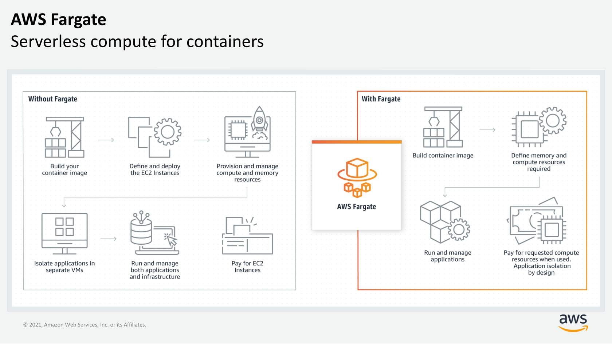

## EC2 instance families

| Instance family       |                                                                                                                                                        Description                                                                                                                                                         |                                                                                                                                                                                                                                                                Use Cases |
|-----------------------|:--------------------------------------------------------------------------------------------------------------------------------------------------------------------------------------------------------------------------------------------------------------------------------------------------------------------------:|-------------------------------------------------------------------------------------------------------------------------------------------------------------------------------------------------------------------------------------------------------------------------:|
| General purpose       |                                                                                           General purpose instances provide a balance of compute, memory, and networking resources, and can be used for a variety of workloads.                                                                                            |                                                                                                                                                          Ideal for applications that use these resources in equal proportions, such as web servers and code repositories |
| Compute optimized     |                                                                                                    Compute optimized instances are ideal for compute-bound applications that benefit from high-performance processors.                                                                                                     | Well-suited for batch processing workloads, media transcoding, high performance web servers, high performance computing (HPC), scientific modeling, dedicated gaming servers and ad server engines, machine learning inference, and other compute intensive applications |
| Memory optimized      |                                                                                                  Memory optimized instances are designed to deliver fast performance for workloads that process large datasets in memory.                                                                                                  |                                                                 Memory-intensive applications, such as high-performance databases, distributed web-scale in-memory caches, mid-size in-memory databases, real-time big-data analytics, and other enterprise applications |
| Accelerated computing |                                  Accelerated computing instances use hardware accelerators or co-processors to perform functions such as floating-point number calculations, graphics processing, or data pattern matching more efficiently than is possible in software running on CPUs.                                  |                                                                                                                Machine learning, HPC, computational fluid dynamics, computational finance, seismic analysis, speech recognition, autonomous vehicles, and drug discovery |
| Storage optimized     | Storage optimized instances are designed for workloads that require high sequential read and write access to large datasets on local storage. They are optimized to deliver tens of thousands of low-latency random I/O operations per second (IOPS) to applications that replicate their data across different instances. |                                                                                                                   NoSQL databases (Cassandra, MongoDB and Redis), in-memory databases, scale-out transactional databases, data warehousing, Elasticsearch, and analytics |
| HPC optimized         |                                                                                        High performance computing (HPC) instances are purpose built to offer the best price performance for running HPC workloads at scale on AWS.                                                                                         |                                                                                                                                     Ideal for applications that benefit from high-performance processors, such as large, complex simulations and deep learning workloads |

## Serverless

With serverless compute, you can spend time on the things that differentiate your application,
rather than spending time on ensuring `availability`, `scaling`, and `managing servers`. Every
definition
of serverless mentions the following four aspects:

- no servers to provision or manage.
- scales with usage.
- You never pay for idle resources.
- Availability and fault tolerance are built in.

## Fargate

AWS Fargate is a purpose-built **serverless compute engine for containers**. AWS Fargate scales and
manages the infrastructure by allocating the right amount of compute. This eliminates the need to
choose and
manage EC2 instances, cluster capacity, and scaling. Fargate supports both Amazon ECS and Amazon EKS
architecture and provides workload isolation and improved security by design.



## AWS Lambda

A **function** is a resource that is invoked to run the code in Lambda. Lambda runs instances of a
function to process events.

**Triggers** describe when a Lambda function should run. A trigger integrates a Lambda function with
other AWS services and event source mappings.

An **event** is a JSON-formatted document that contains data for a Lambda function to process. The
runtime converts the event to an object and passes it to the function code. When you invoke a
function, you determine the structure and contents of the event.

An **application environment** provides a **secure** and **isolated** runtime environment for a
Lambda function. An application environment manages the processes and resources that are required to
run the function.

Lambda supports two types of **deployment packages**:

- A .zip file archive – containing the function code and its dependencies

- A container image – compatible with the Open Container Initiative (OCI) specification. You
  add your function code and dependencies to the image. You must also include the operating system
  and a Lambda runtime.

The **runtime** provides a language-specific environment that runs in an application environment.

The AWS **Lambda function handler** is the method in the function code that processes events. When
the function is invoked, Lambda runs the handler method. When the handler exits or returns a
response, it becomes available to handle another event.

Python example:

```
def handler_name (event, context):

...

return some_value
```

## Pricing

With **On-Demand** Instances, you pay for compute capacity per hour or per second, depending on
which instances that you run. Billing begins whenever the instance is running, and billing stops
when the instance is in a stopped or terminated state.

Use cases:

- low cost and flexibility of Amazon EC2 without upfront payment or long-term
  commitments
- Applications with short-term, spiky, or unpredictable workloads that cannot be interrupted
- Applications being developed or tested on Amazon EC2 for the first time

With Amazon EC2 **Spot Instances**, you can request spare Amazon EC2 computing capacity for up to 90
percent off the On-Demand price.

Use cases:

- Applications that have flexible start and end times
- Applications that are only feasible at very low compute prices
- Users with fault-tolerant or stateless workloads

With Spot Instances, you set a limit on how much you want to pay for the instance hour. This is
compared against the current Spot price that AWS determines. If the amount that you pay is more than
the current Spot price and there is capacity, you will receive an instance.

**Savings Plans** are a flexible pricing model that offers low usage prices for a 1-year or 3-year
term commitment to a consistent amount of usage. Savings Plans apply to Amazon EC2, AWS Lambda, and
AWS Fargate usage and provide up to 72 percent savings on AWS compute usage.

For workloads that have predictable and consistent usage, Savings Plans can provide significant
savings compared to On-Demand Instances.

Use cases:

- Workloads with a consistent and steady-state usage
- Customers who want to use different instance types and compute solutions across different
  locations
- Customers who can make monetary commitment to use Amazon EC2 over a 1-year or 3-year term

For applications with steady state usage that might require reserved capacity, Amazon EC2 offers the
**Reserved Instances** option. With this option, you save up to 75 percent compared to On-Demand
Instance pricing. You can choose between three payment options: All Upfront, Partial Upfront, or No
Upfront. You can select either a 1-year or 3-year term for each of these options.

With **Reserved Instances**, you can choose the type that best fits your applications needs.

- Standard Reserved Instances: These provide the most significant discount (up to 72 percent off
  On-Demand pricing) and are best suited for steady-state usage.
- Convertible Reserved Instances: These provide a discount (up to 54 percent off On-Demand pricing)
  and the capability to change the attributes of the Reserved Instance if the exchange results in
  the creation of Reserved Instances of equal or greater value. Like Standard Reserved Instances,
  Convertible Reserved Instances are best suited for steady-state usage.
- Scheduled Reserved Instances: These are available to launch within the time windows that you
  reserve. With this option, you can match your capacity reservation to a predictable recurring
  schedule that only requires a fraction of a day, a week, or a month.

A **Dedicated Host** is a physical Amazon EC2 server that is dedicated for your use. Dedicated Hosts
can help you reduce costs because you can use your existing server-bound software licenses, such as
Windows Server, SQL Server, and Oracle licenses. And they can also help you meet compliance
requirements. Amazon EC2 Dedicated Host is also integrated with AWS License Manager, a service that
helps you manage your software licenses, including Microsoft Windows Server and Microsoft SQL Server
licenses.

- Dedicated Hosts can be purchased on demand (hourly).
- Dedicated Hosts can be purchased as a Reservation for up to 70 percent off the On-Demand price.

## Amazon VPC

A virtual private cloud (VPC) is an isolated network.
After you create your VPC, you must create **subnets** inside the network. The typical use case for
subnets is to isolate or optimize network traffic. In AWS, subnets are used to provide high
availability and connectivity options for your resources.

**Reserved IPs**

For AWS to configure your VPC appropriately, AWS reserves five IP addresses in each subnet. These IP
addresses are used for routing, Domain Name System (DNS), and network management.

For example, consider a VPC with the IP range 10.0.0.0/22. The VPC includes 1,024 total IP
addresses. This is then divided into four equal-sized subnets, each with a /24 IP range with 256 IP
addresses. Out of each of those IP ranges, there are only 251 IP addresses that can be used because
AWS reserves five.


AWS reserves five IP addresses in each subnet that cannot be assigned to a resource.

The five reserved IP addresses can impact how you design your network. A common starting place for
those who are new to the cloud is to create a VPC with an IP range of /16 and create subnets with an
IP range of /24. This provides a large amount of IP addresses to work with at both the VPC and
subnet levels.

### Gateways

**Internet gateway**

To activate internet connectivity for your VPC, you must create an internet gateway. Think of the
gateway as similar to a modem. Just as a modem connects your computer to the internet, the internet
gateway connects your VPC to the internet. Unlike your modem at home, which sometimes goes down or
offline, an internet gateway is highly available and scalable. After you create an internet gateway,
you attach it to your VPC.
An internet gateway is a VPC component that permits communication between your VPC and the internet.
A virtual private gateway is the VPN endpoint on the Amazon side of your VPN connection that can be
attached to a single VPC.


**Virtual private gateway**

A virtual private gateway connects your VPC to another private network. When you create and attach a
virtual private gateway to a VPC, the gateway acts as anchor on the AWS side of the connection. On
the other side of the connection, you will need to connect a customer gateway to the other private
network. A customer gateway device is a physical device or software application on your side of the
connection. When you have both gateways, you can then establish an encrypted virtual private
network (VPN) connection between the two sides.


**AWS Direct Connect**

To establish a secure physical connection between your on-premises data center and your Amazon VPC,
you can use AWS Direct Connect. With AWS Direct Connect, your internal network is linked to an AWS
Direct Connect location over a standard Ethernet fiber-optic cable. This connection allows you to
create virtual interfaces directly to public AWS services or to your VPC.


### Main route table

When you create a VPC, AWS creates a route table called the **main route table**. A route table
contains a set of rules, called **routes**, that are used to determine where network traffic is
directed. AWS assumes that when you create a new VPC with subnets, you want traffic to flow between
them. Therefore, the default configuration of the main route table is to allow traffic between all
subnets in the local network.

The following **rules** apply to the main route table:

- You cannot delete the main route table.
- You cannot set a gateway route table as the main route table.
- You can replace the main route table with a custom subnet route table.
- You can add, remove, and modify routes in the main route table.
- You can explicitly associate a subnet with the main route table, even if it's already
  implicitly associated.

### Custom route tables

The main route table is used implicitly by subnets that do not have an explicit route table
association. However, you might want to provide different routes on a per-subnet basis for traffic
to access resources outside of the VPC. For example, your application might consist of a frontend
and a database. You can create separate subnets for the resources and provide different routes for
each of them.

If you associate a subnet with a custom route table, the subnet will use it instead of the main
route table. Each custom route table that you create will have the local route already inside it,
allowing communication to flow between all resources and subnets inside the VPC. You can protect
your VPC by explicitly associating each new subnet with a custom route table and leaving the main
route table in its original default state.


### Secure subnets with network access control lists

Think of a network access control list (network **ACL**) as a virtual firewall at the subnet level.
A network ACL lets you control what kind of traffic is allowed to enter or leave your subnet. You
can configure this by setting up rules that define what you want to filter.

Network ACLs are considered **stateless**, so you need to include **both** the **inbound and
outbound** ports used for the protocol. If you don’t include the outbound range, your server would
respond but the traffic would never leave the subnet.

Because network ACLs are configured by **default** to **allow incoming and outgoing traffic**, you
don’t need to change their initial settings unless you need additional security layers.

### Secure EC2 instances with security groups

The default configuration of a **security group** blocks all inbound traffic and allows all outbound
traffic.

Security groups are **stateful**. That means that they will remember if a connection is originally
initiated by the EC2 instance or from the outside, and temporarily allow traffic to respond without
modifying the inbound rules.

_**Example**_

**Subnets** can be used to segregate traffic between computers in your network. **Security groups**
can be used in the same way. A **common design pattern** is to organize resources into different
groups and create security groups for each to control network communication between them.
Network traffic between different resource groups can be controlled using security groups.


This example defines three tiers and isolates each tier with defined security group rules. In this
case, internet traffic to the web tier is allowed over HTTPS. Web tier to application tier traffic
is allowed over HTTP, and application tier to database tier traffic is allowed over MySQL. This is
different from traditional on-premises environments, in which you isolate groups of resources with a
VLAN configuration. In AWS, security groups allow you to achieve the same isolation without tying
the security groups to your network.

## Storage Types


### File storage

Ideal when you require **centralized access** to files that must be **easily shared and managed** by
multiple host computers. Typically, this storage is mounted onto multiple hosts, and requires file
locking and integration with existing file system communication protocols.

#### Use cases for file storage

- **Web serving**: Cloud file storage solutions follow common file-level protocols, file naming
  conventions, and permissions that developers are familiar with. Therefore, file storage can be
  integrated into web applications.


- **Analytics**: Many analytics workloads interact with data through a file interface and rely on
  features such as file lock or writing to portions of a file. Cloud-based file storage supports
  common file-level protocols and has the ability to scale capacity and performance. Therefore, file
  storage can be conveniently integrated into analytics workflows.


- **Media & entertainment**: Many businesses use a hybrid cloud deployment and need standardized
  access using file system protocols (NFS or SMB) or concurrent protocol access. Cloud file storage
  follows existing file system semantics. Therefore, storage of rich media content for processing
  and collaboration can be integrated for content production, digital supply chains, media
  streaming, broadcast playout, analytics, and archive.


- **Home directories**: Businesses wanting to take advantage of the scalability and cost benefits of
  the cloud are extending access to home directories for many of their users. Cloud file storage
  systems adhere to common file-level protocols and standard permissions models. Therefore,
  customers can lift and shift applications that need this capability to the cloud.

### Block storage

File storage treats files as a singular unit, but block storage splits files into fixed-size chunks
of data called blocks that have their own addresses. Each block is an individual piece of data
storage. Because each block is addressable, blocks can be retrieved efficiently. Think of block
storage as a more direct route to access the data.

When data is requested, the addresses are used by the storage system to organize the blocks in the
correct order to form a complete file to present back to the requester. Besides the address, no
additional metadata is associated with each block.

If you want to change one character in a file, you just change the block, or the piece of the file,
that contains the character. This ease of access is why block storage solutions are fast and use
less bandwidth.

#### Use cases for block storage

Because block storage is optimized for **low-latency operations**, it is a preferred storage choice
for **high-performance** enterprise workloads and **transactional**, **mission-critical**, and 
**I/O-intensive** applications.

